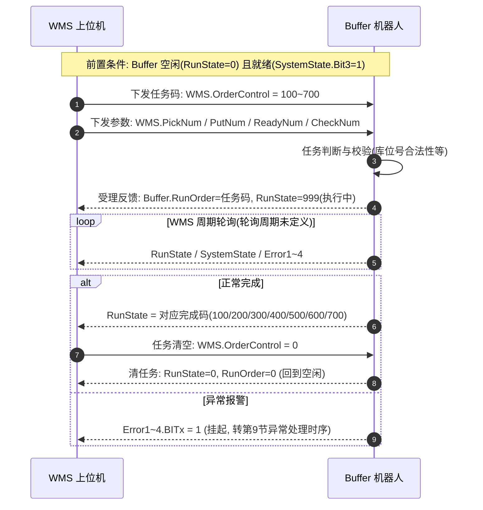
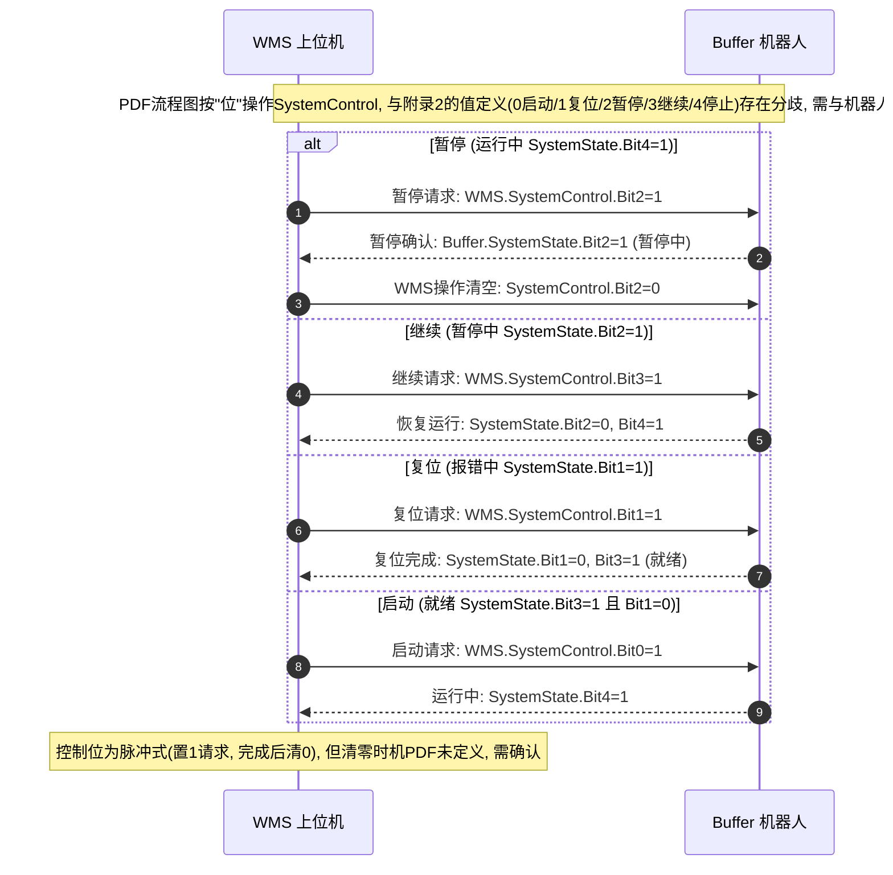
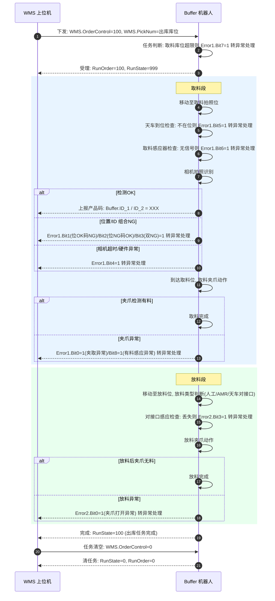
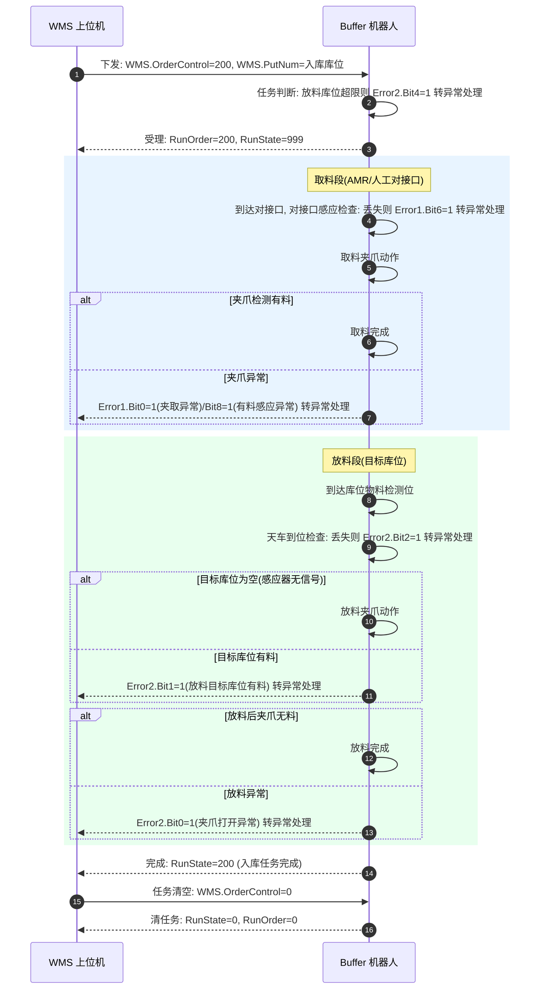
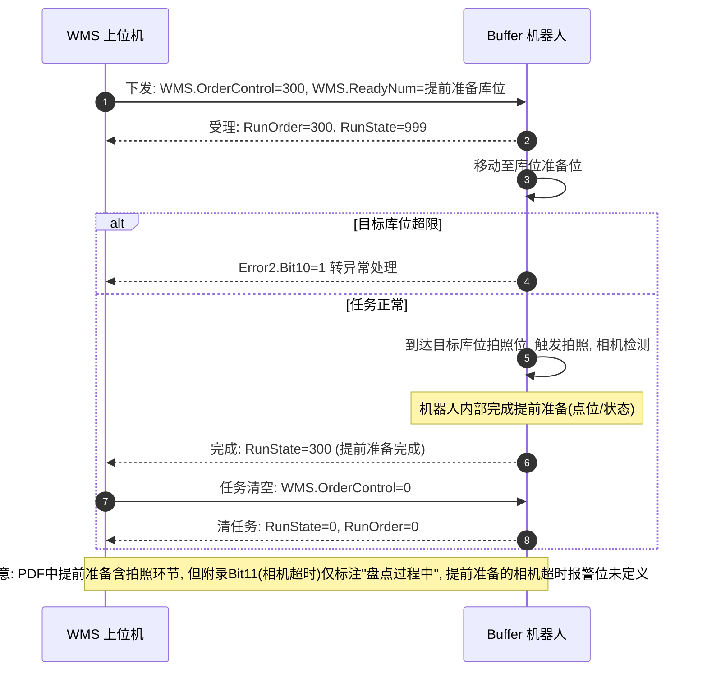
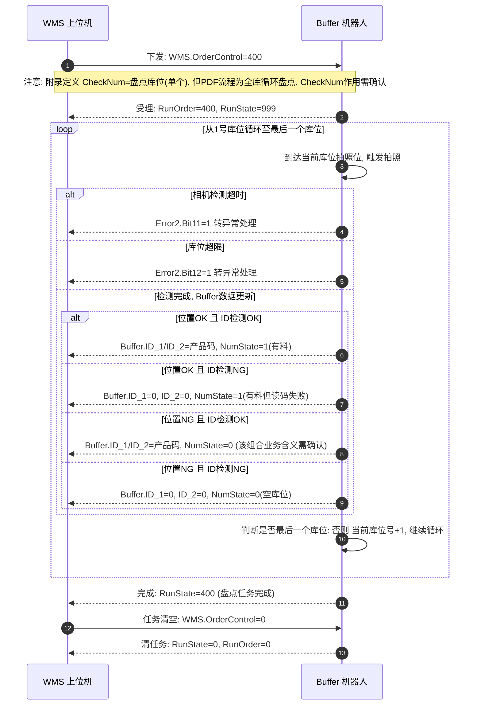
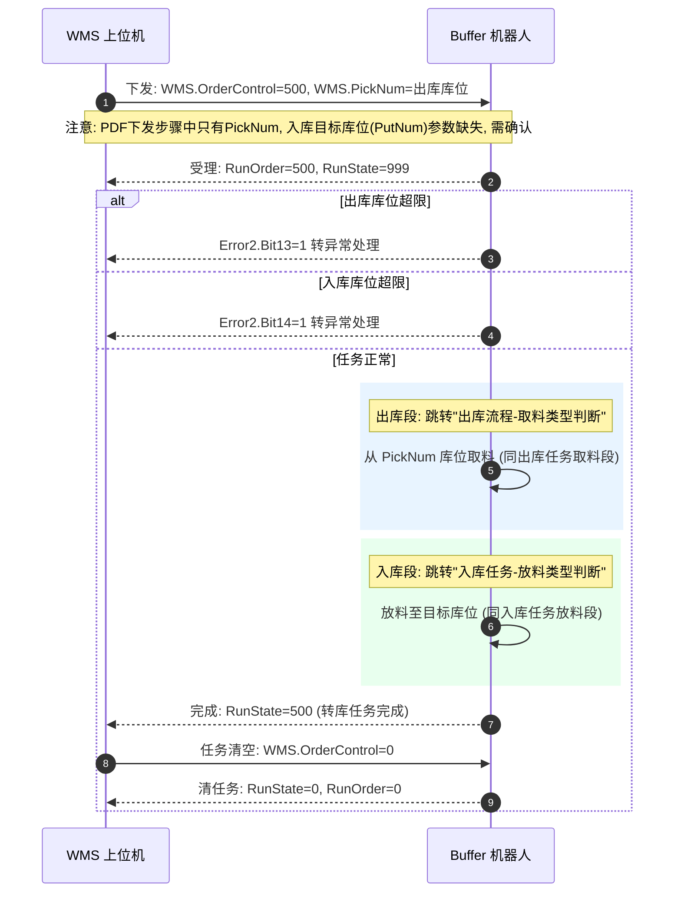
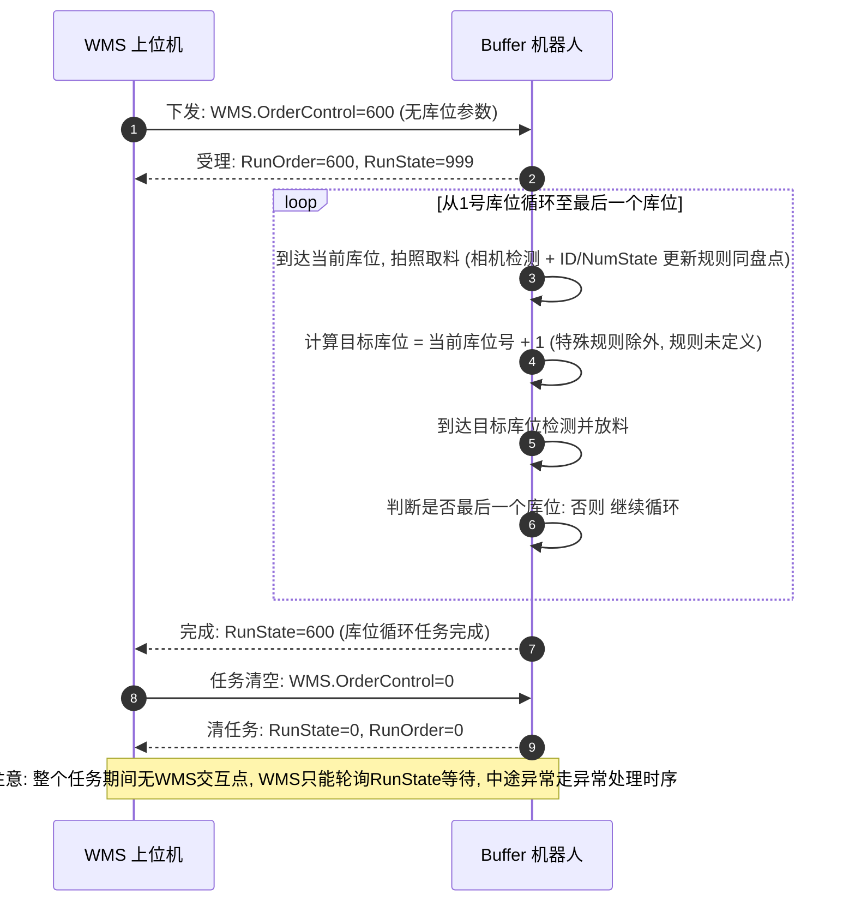
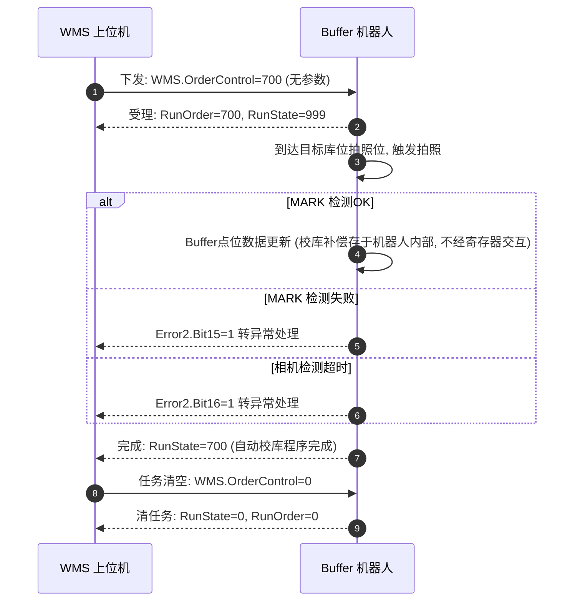
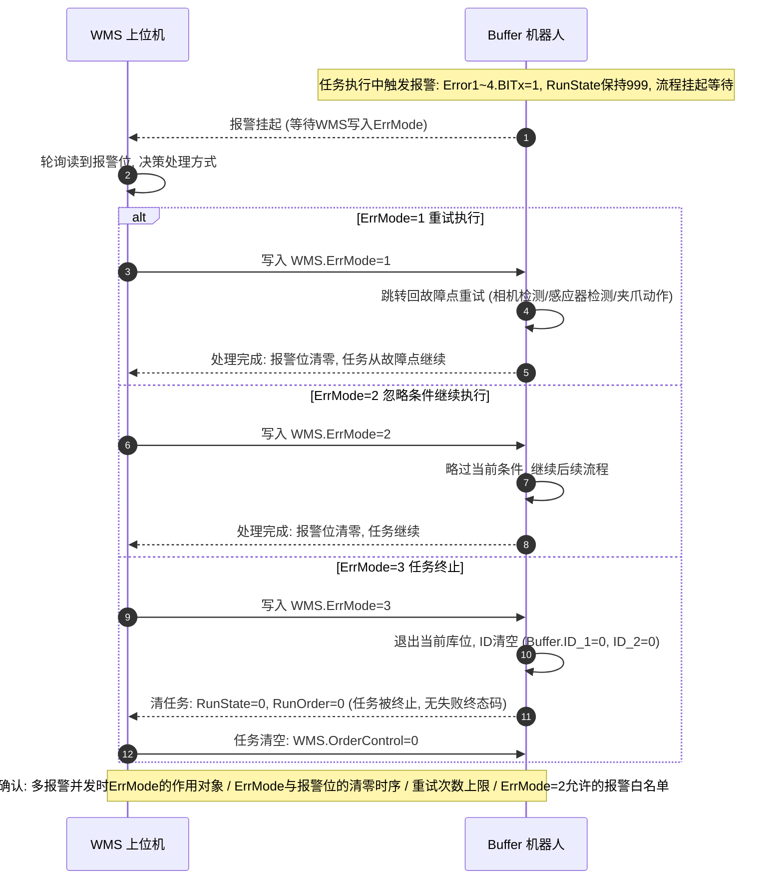

# Buffer(机器人) ↔ WMS(上位机) 任务时序图

> 依据《Buffer-交互表.pdf》流程图整理，报警位定义取自 Excel 附录（两者不一致处已用"注意"标出）。
>
> - 参与方：**WMS 上位机**（写控制区 D4000~D4006）、**Buffer 机器人**（写状态区 D4100~D4114）
> - 通讯：Modbus TCP，WMS 主动轮询，机器人无主动上报能力
> - 本文件为 Mermaid 时序图，在 Trae / VS Code 的 Markdown 预览中可直接渲染

---

## 0. 通用任务生命周期模板

所有任务（100~700）共用同一套交互骨架：

注意：**任务"被 ErrMode=3 终止"后 RunState 直接回 0，没有独立的"失败终态码"**，WMS 只能靠任务状态被清零来间接推断任务被中止。

---

## 1. 系统控制（启动 / 复位 / 暂停 / 继续）

---

## 2. 出库任务（100）

库位取料 → 对接口放料：

---

## 3. 入库任务（200）

对接口取料 → 库位放料：

---

## 4. 提前准备任务（300）

---

## 5. 库位盘点任务（400）

全库循环拍照，逐库位更新 ID / NumState：

注意：**ID_1 / ID_2 / NumState 是单一寄存器，盘点过程中被逐库位覆盖更新**。WMS 若要留存全库数据，必须在循环执行期间实时高频轮询，一旦错过即漏读。

---

## 6. 转库任务（500，出库+入库）

---

## 7. 库位循环任务（600）

整库物料逐库位后移（当前库位取料 → 下一个库位放料）：

---

## 8. 自动校库任务（700）

---

## 9. 异常处理通用时序（ErrMode = 1 / 2 / 3）

所有任务的报警均走此模式（Error1=取料过程，Error2=放料过程，Error3=设备级，Error4 未定义）：

---

## 附 A. 图中使用的寄存器速查

### WMS → Buffer（控制区）

| 寄存器 | 地址 | 说明 |
|---|---|---|
| WMS.OrderControl | D4000 | 任务指令：0清除/100出库/200入库/300提前准备/400盘点/500转库/600库位循环/700自动校库 |
| WMS.SystemControl | D4001 | 系统指令：启动/复位/暂停/继续（值语义与位语义存在分歧） |
| WMS.ErrMode | D4002 | 异常处理：1重试/2忽略/3终止（与 PickNum 地址冲突，待确认） |
| WMS.PickNum | D4002(?) | 出库库位 |
| WMS.PutNum | D4003 | 入库库位 |
| WMS.ReadyNum | D4004 | 提前准备库位 |
| WMS.CheckNum | D4005 | 盘点库位（作用待确认） |
| WMS.Function | D4006 | 功能屏蔽：bit0相机/bit1夹爪传感器/bit2天车传感器 |

### Buffer → WMS（状态区）

| 寄存器 | 地址 | 说明 |
|---|---|---|
| Buffer.SensorState | D4100 | 感应器状态映射（附录6） |
| Buffer.ClampState | D4101 | 夹爪状态：0无料/1有料 |
| Buffer.RunOrder | D4102 | 当前执行任务码 |
| Buffer.RunState | D4103 | 0空闲/999执行中/100~700对应任务完成 |
| Buffer.ErrModeState | D4104 | 异常处理模式反馈（与 SystemState 地址冲突，待确认） |
| Buffer.SystemState | D4104(?) | bit0急停/bit1报错/bit2暂停/bit3就绪/bit4运行 |
| Buffer.NumState | D4105 | 库位状态（附录缺失定义） |
| Buffer.ID_1 / ID_2 | D4106 / D4107 | 产品二维码（4字节容量，字节序未定义） |
| Buffer.Error1 | D4111 | 取料过程报警 bit0~8 |
| Buffer.Error2 | D4112 | 放料过程报警 bit0~5, bit10~16 |
| Buffer.Error3 | D4113 | 设备级：bit0急停/bit1~2机械手/bit3~7安全门/bit8~11光栅 |
| Buffer.Error4 | D4114 | 未定义 |

## 附 B. 整理过程中确认的存疑点（与机器人方对齐）

1. D4002、D4104 两处地址冲突（大概率是表格漏移位）
2. SystemControl 按位操作（PDF）还是按值操作（附录2）
3. 任务500 下发参数缺 PutNum
4. CheckNum 单库位定义 vs 盘点全库循环流程
5. 盘点"位置NG & ID检测OK"组合的 ID/NumState 写入规则
6. 提前准备任务的相机超时报警位未定义
7. 库位循环任务"+1 特殊规则"内容未定义
8. 异常处理四要素：并发报警对象、ErrMode 清零时机、重试上限、ErrMode=2 白名单
9. 任务终止无失败终态码，WMS 无法区分"完成"与"中止"
