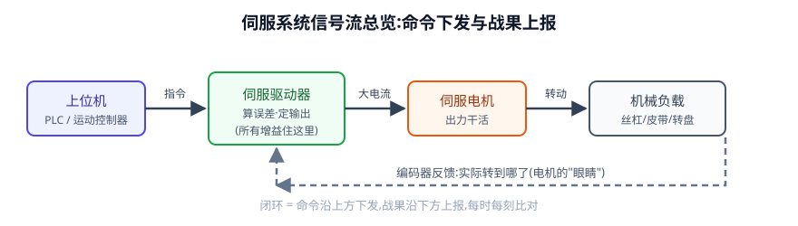
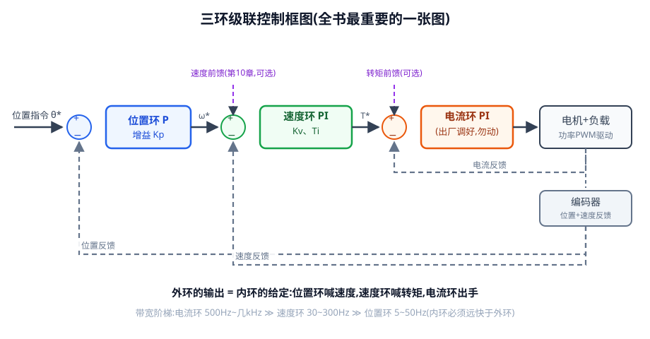
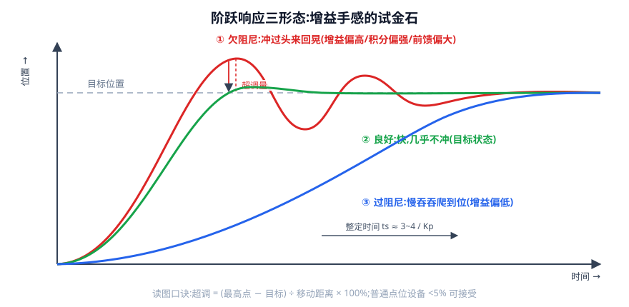
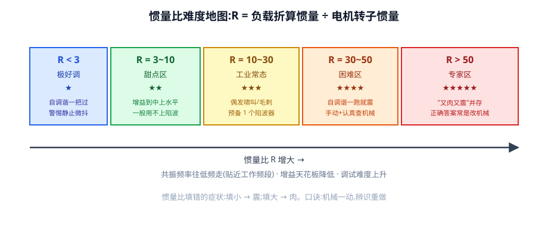
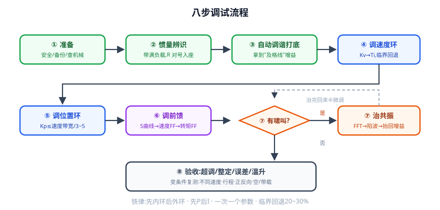
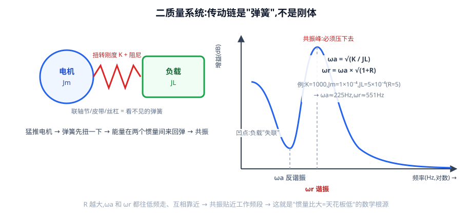
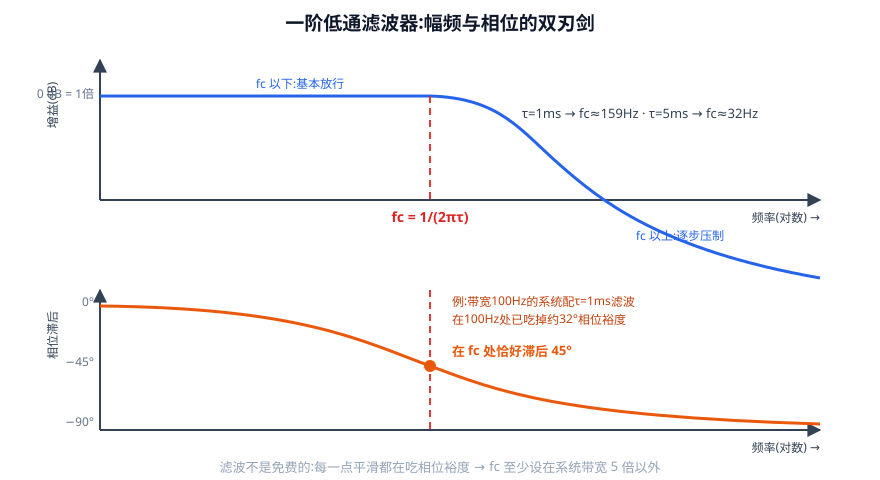
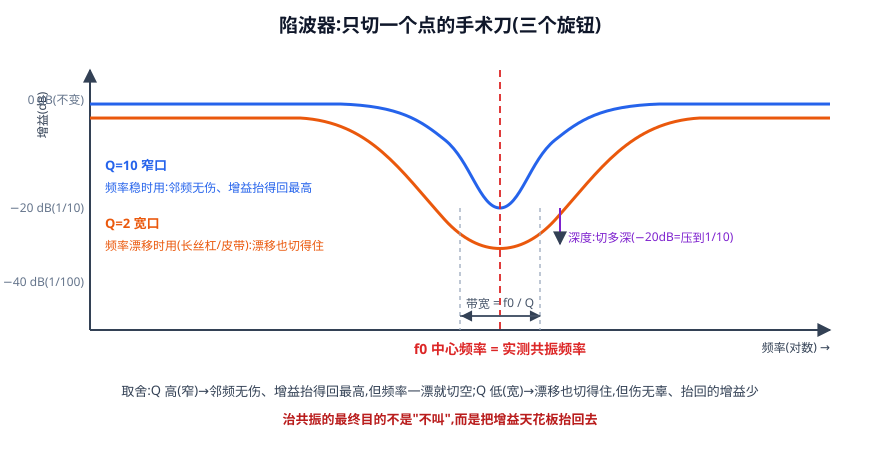
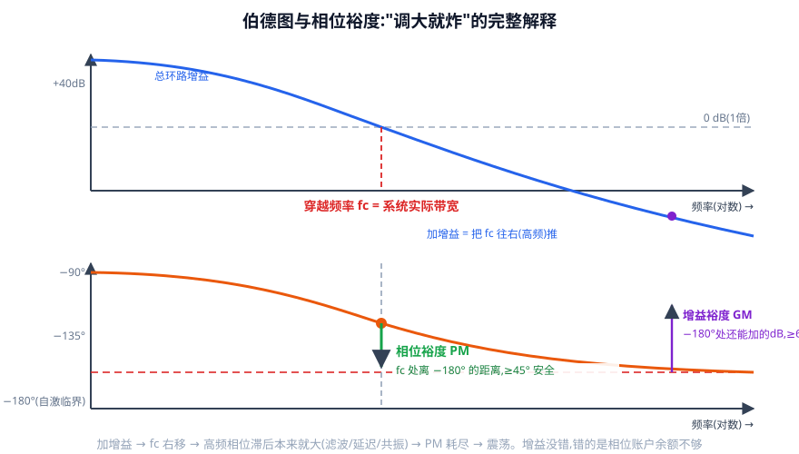

# 伺服增益调试从零基础到高手 · 完整版(单文件)

> 这是一份**假设你连"转矩""Hz""kg·m²"都没学过**也能读懂的教程。
> 全文一条主线:
> **误差是伺服唯一要消灭的东西。三环是"分级消灭误差"的架构;增益决定纠错的力度;力度太大就撞上"机械共振"这堵墙;滤波和陷波负责拓宽这堵墙;前馈负责绕过这堵墙。**
>
> 读法约定:
> - 💭 **想一想**:思考题。先自己想 30 秒,再看答案——"从现场症状反推出参数病根"的功夫全靠它练;
> - **例题**:请拿计算器跟着算,算过一遍才是你的;
> - **图解**:正文关键处嵌有 9 张矢量图(存于同目录 `图解/` 文件夹,SVG 格式可无损缩放),配 ASCII 图对照看;
> - ⚠:新手最容易踩的坑;
> - 每章末尾有"本章要点",全书末尾有公式速查、术语表、厂商对照、故障速查大表。

## 全书目录

- 第0章 预备知识:读懂本书需要的物理量(转速/转矩/惯量/刚度/频率/分贝/PID白话)
- 第1章 伺服系统到底是什么
- 第2章 误差:整个系统拼命消灭的东西
- 第3章 三环:伺服的内部结构
- 第4章 增益的直觉与"调好了"的标准
- 第5章 惯量比:最重要的体检指标(五个区间的现场现象)
- 第6章 参数详解:每个旋钮设小了/设大了会怎样
- 第7章 调试前的准备
- 第8章 八步调试流程
- 第9章 看波形:调试者的眼睛
- 第10章 前馈:让误差还没发生就被补偿
- 第11章 共振:增益的天花板
- 第12章 滤波器:双刃剑
- 第13章 陷波器:只切一个点的手术刀
- 第14章 稳定性:为什么"调大就炸"(高手级)
- 第15章 高手武器库
- 第16章 综合案例三则
- 第17章 故障速查大表(20条)
- 附录 公式速查/术语表/厂商对照/记录表/自检清单/计算题答案/厂家手册精华

---

# 第0章 预备知识:读懂本书需要的物理量

> 伺服调参的"语言"只有七八个物理量。这一章把它们全部翻译成白话,并教你认单位。
> 已经懂的小节可以跳过;读到后面哪个单位眼生,就翻回这里查。

## 0.1 转速的三种写法:rpm、r/s、rad/s

电机行业有个讨厌的习惯:**同一个转速,三种单位混着用**。必须先学会换算,否则参数表都读不懂。

| 单位 | 全称 | 白话 |
|---|---|---|
| rpm | 转/分钟 | 每分钟转几圈(电机铭牌常用) |
| r/s | 转/秒 | 每秒转几圈 |
| rad/s | 弧度/秒 | 每秒转多少弧度(公式推导常用) |

**它们的关系,一句话:一圈 = 2π 弧度 ≈ 6.28 rad。**(π≈3.14159,是圆的周长和直径的比,任何圆都一样。2π 就是一整圈换算成"弧度"这个单位后的数值。)

**换算口诀**:rpm ÷ 60 = r/s;r/s × 6.28 = rad/s。

**例题 0-1**:电机铭牌写 3000 rpm,换算成另外两种单位:

```
3000 rpm ÷ 60 = 50 r/s        (每秒转 50 圈)
50 r/s × 6.28  = 314 rad/s
```

记住这个数:**3000 rpm = 50 r/s = 314 rad/s**,后面反复用到。

> 💭 **想一想**:一台电机 1500 rpm,是多少 r/s?多少 rad/s?
> **答案**:1500÷60=25 r/s;25×6.28≈157 rad/s。(熟练这步换算,第6章的跟随误差计算才不会卡壳。)

## 0.2 力与转矩:直线世界的力,旋转世界的转矩

**力(符号 F,单位:牛顿 N)**:推、拉东西的劲。1 N 有多大?**大约提起两个鸡蛋的力**(鸡蛋约 50 克一个,g≈10 时 0.1 kg 物体受重力约 1 N)。

**转矩(符号 T,单位:N·m,读"牛米")**:让东西**转**起来的劲。

**拧瓶盖就是转矩**:你捏着瓶盖边缘用力,力是往切线方向的,但瓶盖是被"拧"着转的——起作用的是 **力 × 半径**:

```
转矩 T = 力 F × 力臂半径 r
```

**例题 0-2**:皮带轮半径 0.1 m,皮带边缘拉着 10 N 的力,轮子上加了多少转矩?

```
T = 10 N × 0.1 m = 1 N·m
```

电机铭牌上的"额定转矩 1.27 N·m",意思就是:这台电机持续输出时,能一直提供 1.27 牛·米的"拧劲"。你以后调的"转矩指令""转矩限制",单位都是它。

> 💭 **想一想**:同样 1 N·m 的转矩,装在半径 0.05 m 的小带轮上和 0.2 m 的大带轮上,边缘能产生多大的拉力?
> **答案**:小带轮 1÷0.05=20 N;大带轮 1÷0.2=5 N。**轮子越小,同样的转矩能拉的力越大——这就是减速机构"用转速换力"的原理**,第5章讲惯量折算时会再次用到这个思想。

## 0.3 惯性:质量与转动惯量

**牛顿第一定律的白话:万物都懒。**静止的懒得动,运动的懒得停;你推它,它跟你"拗"的程度,直线世界叫**质量 m(单位 kg)**,旋转世界叫**转动惯量 J(单位 kg·m²)**。

两条对应的公式(背下来,全书反复用):

```
直线:力 = 质量 × 加速度          F = m·a
旋转:转矩 = 转动惯量 × 角加速度   T = J·α     (α 读"阿尔法",单位 rad/s²)
```

**转动惯量和质量的关键区别:同样重的东西,质量分布离转轴越远,越难转。**
生活实验:健身哑铃,铃片拧在最里档和最外档,重量一样,甩起来感觉完全不同——外面的费劲得多。

均质圆盘的转动惯量(最常用的公式):

```
J = ½ × m × r²        (m=质量 kg,r=半径 m)
```

注意是**半径的平方**——半径翻倍,惯量翻四倍。这就是"细长"的东西好转、"大饼"式的东西难转的原因。

**kg·m² 这个单位有多大?** 伺服世界里的惯量通常小得很,常用科学计数法表示。先补一课:

```
10⁻⁴ 的意思:小数点往左移 4 位 → 1.0×10⁻⁴ kg·m² = 0.0001 kg·m²
10⁻⁵ = 0.00001
```

给几个实体感觉:
- 400~750 W 伺服电机自己的转子惯量 Jm:大约 1×10⁻⁴~3×10⁻⁴ kg·m²(一根手指粗细、几厘米长的金属圆柱);
- Φ20 mm、长 1 m 的实心钢丝杠:约 1.2×10⁻⁴ kg·m²(第5章会手算);
- 直径 20 cm、厚 5 cm 的实心钢盘:约 0.06 kg·m²(质量≈12 kg,J=½×12×0.1²);
- 直径 1 m、厚 2 cm 的钢转盘:约 15 kg·m²(质量≈123 kg)。

看到了吧:**半径平方的威力**——同样是百来公斤钢,做成 1 米大盘子比做成 20 厘米厚盘难转两百多倍。

## 0.4 弹簧与刚度:万物皆弹簧

**刚度(符号 K)**:弹簧硬不硬。直线弹簧:压 1 mm 需要多少 N,单位 N/mm;旋转世界:**扭转刚度**,单位 N·m/rad——扭 1 弧度需要多少转矩。

直觉:扭矩大、轴粗短、联轴节的弹性块硬 → K 大;轴细长、皮带松、弹性块软 → K 小。

**关键认知(第11章的地基)**:钢看着是"死硬"的,但**一切机械在力的作用下都会微变形**,只是肉眼看不出来。所以电机和负载之间的每一根轴、每一个联轴节、每一条皮带,都是一根"看不见的弹簧"。**这根弹簧,就是日后共振的种子。**

## 0.5 频率与带宽:每秒多少次

**频率,单位赫兹 Hz:每秒重复多少次。**
- 市电 50 Hz:电压每秒变化 50 个来回;
- 人耳能听 20~20000 Hz——伺服啸叫通常在几百到几千 Hz,正好在耳朵最敏感的区间,所以"用耳朵诊断"是有物理依据的(第6章音色分诊)。

**带宽(全书最重要的白话定义)**:

> **带宽 = 一套系统"每秒最多能跟上多少次变化"的上限。**

打比方:你和朋友传接球。一秒传 1 次,谁都接得住;一秒 10 次,开始漏;一秒 50 次,完全跟不上。"你最多能接住每秒几次"就是你的"带宽"。

伺服三环各自有一个带宽:速度环带宽 100 Hz,意思是"指令以每秒 100 次的节奏变来变去,我还能跟上;再快就跟不上了"。**增益调高,本质就是把带宽往高推**——但推到某个高度,会遇到两类墙:①自身反应极限(延迟);②机械共振(第11章)。

## 0.6 分贝 dB:倍数的另一种写法(很多人被它吓退,其实很简单)

滤波器、陷波器的"深度"都写成分贝。它只是**把倍数换个写法**,因为振动的强弱范围太大(从 1 倍到几万倍),直接写数字不好画图。

**只需要记三行换算**:

```
0 dB   = 1 倍(没变)
每 -20 dB = 压到原来的 1/10
每 +6 dB  ≈ 放大到 2 倍
```

所以:
- 陷波深度 -20 dB:把那个频率的振动**压到十分之一**;
- 深度 -40 dB:压到**百分之一**;
- 增益裕度 GM ≥ 6 dB:增益还能再放大 2 倍才到危险线。

> 💭 **想一想**:陷波器设了 -30 dB,大约把共振压到原来的几分之一?
> **答案**:-20dB 是 1/10,再往下 10 dB 约再除以 3.16(√10),合计 1/31.6。粗略记:**-30 dB ≈ 三十分之一**。

## 0.7 比例、积分、微分:三个 corrective 动作的白话(PID)

用一个"水池保持水位"的例子,把 PID 一次讲透。目标:水位维持在 1 米,你手里一个进水阀门。

| 动作 | 白话 | 做法 | 好处 | 坏处 |
|---|---|---|---|---|
| **P 比例** | 现在差多少,立刻按比例开阀 | 水位低 20 cm,就把阀门开到某个跟 20 成比例的开度 | 反应快 | **永远差一点点**(水位接近目标时,误差变小,阀门开度也变小,最后停在"差一点点"的平衡——这叫稳态误差) |
| **I 积分** | 把"一直差着的那点"记账,慢慢补 | 只要还差着,阀门开度就一点一点持续加大 | **最终把稳态误差磨到零** | 动作慢;**容易过头**(水位到 1 米时,账上已经多补了,冲过去,再回头,来回晃) |
| **D 微分** | 看水位变化的快慢,提前刹车 | 水位快速上涨时提前关小阀 | 抑制冲过头 | **水位计一抖就乱开阀**(把噪声放大) |

伺服三环用的就是这三招:
- 位置环:纯 P(第3章解释为什么);
- 速度环:P + I(Kv 是力度,Ti 是记账快慢);
- 电流环:P + I(出厂调好)。
- D 因为放大噪声,在伺服里很少单独用,通常藏在厂商的"模型控制"里(第15章)。

## 0.8 为什么公式里老出现 2π

因为**"圈"和"弧度"之间隔着一个 2π**。丝杠转一圈走一个导程,而公式里的角速度用 rad/s,所以"转一圈"=2π rad,换算时就出现 2π。见到 2π 不用慌,它只是单位换算的桥。

## 0.9 单位速查表(打印贴墙)

| 量 | 单位 | 白话 | 换算 |
|---|---|---|---|
| 转速 | rpm / r/s / rad/s | 每分钟几圈 / 每秒几圈 / 每秒几弧度 | rpm÷60=r/s;r/s×2π=rad/s |
| 力 | N | 提两个鸡蛋的劲 | — |
| 转矩 | N·m | 拧劲 = 力×半径 | — |
| 质量 | kg | — | — |
| 转动惯量 | kg·m² | 旋转的懒惰,和半径平方挂钩 | 圆盘 J=½mr² |
| 刚度 | N·m/rad | 弹簧硬度 | — |
| 频率 | Hz | 每秒几次 | — |
| 位置环增益 Kp | s⁻¹(1/秒) | 见第6章,为什么是"每秒" | Kp=50 → 位置带宽≈50/6.28≈8 Hz |
| 速度环增益 Kv | Hz 或 s⁻¹ | 厂商而异,先查手册 | — |
| 积分时间 Ti | ms | **值越小积分越强** | — |
| 分贝 dB | — | 倍数的对数写法 | -20dB=1/10 |
| 转矩常数 Kt | N·m/A | 每 1 安培电流出多少转矩 | T=Kt×I |

---

# 第1章 伺服系统到底是什么

## 1.1 先讲电机:把电变成转

电机 = 用电的"劲"。通电后,电机内部产生磁场,磁场推着里面的转动部分(转子)转起来。电风扇、电动车窗、洗衣机,全是电机。

但"会转"远远不够。精密设备需要的是:**转到哪、转多快、出多大力,全都精确受控,而且随时报告进度**。于是行业里长出了三条技术路线:

## 1.2 三种"让它转"的路线:开环、半开环、闭环

| 路线 | 代表 | 怎么定位 | 知不知道自己实际转到哪 | 一句话点评 |
|---|---|---|---|---|
| 开环 | 步进电机 | "发 1000 个脉冲,你就该走 1000 步" | **不知道**(假设没丢步) | 便宜、简单;但卡一下就全错,且错了没人知道 |
| 开环调速 | 变频器+异步电机 | 只调速不精确定位 | 不知道 | 风机、水泵、传送带够用 |
| **闭环** | **伺服** | "走到哪都有眼睛盯着,差一点就补一点" | **完全知道**(编码器实时上报) | 又快又准又有力;贵,需要调参(就是本书) |

> 💭 **想一想**:步进电机指令走 10000 步,中途被卡了一下实际只走了 9500 步。它停在哪?上位机以为它在哪?
> **答案**:它实际停在 9500 步的位置,上位机以为已经走满 10000 步,**500 步的错永远无人知晓、无人修正**。伺服靠编码器当场发现"我在 9500",立刻把差的 500 步补上。这就是"闭环"三个字的全部含义。

## 1.3 伺服系统的四大件

| 部件 | 角色 | 一句话职责 | 白话细节 |
|---|---|---|---|
| **上位机**(PLC/运动控制器/数控系统) | 上级 | 发命令:"走到 100 mm""以 3000 rpm 转" | 通过**脉冲信号**或**通讯总线**(EtherCAT/PROFINET 等)下命令 |
| **伺服驱动器** | 大脑 | 收指令、比反馈、算误差、决定输出多大电流 | 你调的所有参数都住在它里面;面板上有显示屏和按键,USB/网口连电脑 |
| **伺服电机** | 手 | 把电能变成转动 | 转子故意做成细长形——惯量小,动作灵敏(呼应 0.3 节:质量集中难转,细长好转) |
| **编码器** | 眼睛 | 装在电机尾部,实时报告转到哪个角度、转多快 | **分辨率**:23 位编码器一圈分 2²³=8,388,608 份,每份约 0.00004°——比头发丝还细的角度都能看见 |

信号流(全书反复出现):

```
上位机 ──指令──► 驱动器 ──大电流──► 电机 ──机械转动──► 设备干活
                  ▲                                    │
                  └─────── 编码器反馈(实际到哪了)◄──────┘
```



## 1.4 编码器两种,驱动器"算误差"用的都是内部脉冲

- **增量式**:只报告"转过了多少",断电后位置丢失(需回零);
- **绝对式**:每个角度有唯一编号,断电再上电还记得自己在哪(现在的主流)。

**驱动器内部的"通用货币"是脉冲数**:不管上位机发的是脉冲还是总线指令,也不管编码器是多少位,统统换算成内部的位置计数。上位机 1 个脉冲对应电机走多少,由**电子齿轮比**参数决定——这就是"脉冲当量"。

**例题 1-1**:编码器 23 位(8,388,608/圈),上位机按 10,000 脉冲/圈发指令。电子齿轮比 = 8,388,608 ÷ 10,000 ≈ 838.86,意思是**上位机每发 1 个脉冲,电机内部走 838.86 个编码器单位**。

> 你不需要会设它才能调增益,但必须知道:**后文说的"误差几个脉冲",指的是内部脉冲**。丝杠导程 10 mm 时,若按 10,000 脉冲/圈折算,1 个脉冲 = 0.001 mm——这就是大家嘴里"1 微米分辨率"的来历。

## 1.5 闭环的直觉:淋浴调水温(伺服所有毛病的原型)

住过老式酒店的人都会这个"舞蹈":淋浴拧一下,要等 2 秒水才变温。

1. 觉得冷,往热水拧一点;
2. 等 2 秒,还是冷,再拧;
3. 突然烫了!赶紧回拧;
4. 又过 2 秒,凉了……

这张表把全书要治的病全预演了:

| 淋浴现象 | 伺服术语 | 病根章节 |
|---|---|---|
| 拧了要等才有反应 | 响应慢 | 增益低(第6章) |
| 突然烫过头 | 超调 | 增益偏大或积分偏强 |
| 冷热来回振荡 | 低频振荡 | 纠错太猛+环路有延迟 |
| 温度总差一点点才对 | 稳态误差 | 缺积分(0.7 节水池例) |
| 越急越猛,振荡越凶 | 增益越高越震荡 | 增益与延迟的根本矛盾(第14章) |

**以后调参遇到任何怪现象,先问:这在淋浴上对应哪一幕?**

## 1.6 伺服都用在哪,为什么要"调"

CNC 机床、工业机器人、贴片机、激光切割、注塑机、印刷机、AGV、光刻机工件台——凡是"又快又准"的运动都是伺服。

一台设备的伺服工程分四步:**安装接线 → 对点(点动、试方向)→ 增益调试(本书)→ 试产维护**。

调参,就是让设备从"能动"变成"好用"的那一步。而它前面永远横着一个前提:

> ⚠ **机械问题占一半,参数问题占三成。**联轴节松了、皮带松了、有齿隙,神仙参数也救不了。调参前先摸机械(第7章有检查清单)。

## 1.7 本章要点

1. 闭环=有眼睛(编码器),错了立刻补;步进开环,错了没人知道;
2. 四大件:上位机发令、驱动器算账、电机出力、编码器报告;
3. 驱动器内部一切位置都是"内部脉冲",电子齿轮比决定 1 脉冲走多少;
4. 淋浴比喻是全书病例库的原型;
5. 机械烂,参数救不了。

---

# 第2章 误差:整个系统拼命消灭的东西

## 2.1 定义

```
误差 e = 指令位置 − 实际位置(编码器报告的)
```

- 误差为正:实际**落后**于指令(最常见);
- 误差为负:实际冲到了指令前面(超调的瞬间)。

驱动器每个控制周期(几十微秒~一百多微秒,快到人无法想象)都在算这个数,并用它决定输出。**它一辈子只干一件事:让误差趋近 0。**

> 💭 **想一想**:误差能不能是完美的 0?
> **答案**:静止定位后可以接近 0(靠速度环积分磨平);**运动中永远不为 0**——因为反馈是"先错后改"(0.7 节 P 的宿命:看到误差才动作)。匀速运动时会稳定在一个固定值上,叫**跟随误差**,第6章给出公式 Δp = v/Kp,那时你会算出:3000 rpm、Kp=50 时整整落后一圈。

## 2.2 误差的三种时刻(读波形时对号入座)

| 时刻 | 误差长相 | 名字 |
|---|---|---|
| **静止(定位完成后)** | ≈0,微小抖动 | 稳态 |
| **匀速运动中** | 稳定在某个常数,速度越快越大 | **跟随误差**(第6章公式) |
| **加减速中** | 冲高再回落,全周期最大 | 动态误差 |

**偏差计数器**:驱动器里专门存放位置误差的计数器(单位:内部脉冲)。调试软件示波器里的"偏差""Err"通道就是它——**第9章看波形,看的就是它的曲线**。

## 2.3 误差大了有什么实际坏处

- 单轴:定位慢、加工轮廓偏;
- **两轴联动画圆**:两轴误差不同 → 圆变成椭圆;换向瞬间摩擦突变 → 象限处出凸起(第16章案例3);
- 高速贴装/激光:直接决定产能和加工质量。

所以整个第三部分(调试流程)的验收指标,全是围绕误差的三个时刻制定的。

## 2.4 本章要点

1. e = 指令 − 反馈;正=落后,负=超前;
2. 运动中误差永不为零,匀速时稳定为跟随误差;
3. 偏差计数器=误差的家,示波器上看它;
4. 误差的坏处在多轴联动时被放大。

---

# 第3章 三环:伺服的内部结构

## 3.1 为什么要套三层?一个环不行吗?

假设驱动器直接拿"位置误差"算电流,一个环搞定。听起来简单,实际上做不到,因为**三件事的速度尺度差了三个数量级**:

| 要管的事 | 发生的时间尺度 | 需要的反应速度 |
|---|---|---|
| 电流跟不跟得上转矩指令(力气给没给到位) | 10⁻⁵~10⁻⁴ 秒 | 极快 |
| 转速跟不跟得上 | 10⁻³ 秒 | 快 |
| 位置到没到 | 10⁻² 秒 | 可慢些 |

用一个旋钮同时伺候三个速度尺度,顾此失彼(淋浴拧阀的速度不可能同时适合"肌肉反应"和"水温变化")。所以分成三层,**每层只管一件事,每层的输出作为下一层的指令**——这叫**级联控制**,俗称三环。

打个公司比方:
- **位置环=董事长**:只关心"项目(工件)到位没有",不管细节;
- **速度环=部门经理**:接到目标,安排"进度(转速)";
- **电流环=一线员工**:接到进度,实际"出力干活",肌肉级反应。

董事长不亲自拧螺丝;但员工不能比董事长还慢半拍——命令传到时黄花菜都凉了。这句大白话,就是后面"带宽阶梯"规则(3.7)的全部内容。

## 3.2 结构图(全书最重要的一张图,建议默画)

```
位置指令 θ*──►(−)──►【位置环 P:Kp】──ω*──►(+)──►【速度环 PI:Kv,Ti】──T*──►【电流环 PI】──► 功率PWM ──► 电机 ──► 机械负载
             ▲                 ▲ (+速度前馈ω*FF,可选)        ▲(+转矩前馈T*FF,可选)                │
             │                 └────────────┐                  └──┐                                 │
             └──── 位置反馈 ◄───────────────┴── 速度反馈 ◄─────────┴── 电流反馈 ◄─────────────────────┘
                                          (位置/速度反馈来自编码器)
```



**教你看框图(新手三步)**:
1. 从左上角找指令入口;
2. 沿箭头向右穿:每穿过一个方框,信号被"加工"一次;
3. 沿底下那条反馈线从右回到左:战果上报,在圆圈"(−)"处和指令相减——**这个圆圈就是误差诞生的地方,也是全书的主角**。

| 环 | 它比较什么 | 它输出什么 | 控制器形式 |
|---|---|---|---|
| 位置环 | 指令位置 vs 实际位置 | **速度指令 ω\***(该转多快) | 纯 P(Kp) |
| 速度环 | 速度指令 vs 实际速度 | **转矩指令 T\***(该出多大力) | P+I(Kv,Ti) |
| 电流环 | 转矩指令(=电流)vs 实际电流 | PWM 电压(驱动功率管) | P+I(出厂调好) |

**记住"外环的输出=内环的给定"**,一句话就说清了三环的关系。

## 3.3 电流环:最里层,"肌肉的神经反射"

- **管什么**:让流进电机绕组的电流,精确快速地跟上指令。因为电机转矩和电流成正比(**T = Kt × I**,Kt 叫转矩常数,在电机手册里,比如 Kt=1.1 N·m/A 时给 5 A 电流出 5.5 N·m),**管住电流=管住出力**;
- **多快**:带宽几百 Hz 到几 kHz,三环最快;
- **比喻**:伸手拿杯子时手指自动调整握力,不需要大脑指挥每一根肌纤维;
- **⚠ 你要不要动它:不要。**它按电机的电阻、电感等参数出厂整定,和你的负载基本无关。手册里若见到"电流环增益/电流积分"等参数,标着出厂设定——**把它当成发动机气门间隙,是厂商车间里调的东西**。

## 3.4 速度环:中间层,"汽车的定速巡航"

- **输入**:速度指令 ω*(来自位置环);
- **反馈**:编码器测的转速;
- **输出**:转矩指令 → 交给电流环。

**两个旋钮(你的主战场之一)**:

1. **速度环增益 Kv(比例)**:当前速度差多少,立刻按比例出多大的转矩。
   巡航比喻:平路 100 km/h;上坡掉到 95,**立刻**补油门——补多猛,就是 Kv;
2. **速度积分时间常数 Ti(积分)**:把持续存在的速度差"记账"慢慢补。
   坡一直陡,油门就一直多踩一点——记账的快慢就是 Ti。
   ⚠ **方向陷阱:Ti 是时间,值越小=补得越急=积分越强**(第6章细讲)。

**为什么抗扰刚性主要靠它**:切削力、摩擦、重力这些外力扰动,最先、最直接打在速度环上。Kv 硬,轴就"顶得住";Kv 软,一压就偏。全书说"刚性",默认说的是这里。

> 💭 **想一想**:为什么积分放速度环,位置环却用纯 P?
> 提示:匀速带负载时,谁面对"持续偏差"?水池比喻(0.7)里"记账磨平稳态误差"的任务该给谁?
>
> **答案**:匀速对抗摩擦/重力需要**持续转矩**——这是速度环面对的持续偏差,该由速度环的积分记账补齐。位置环若再加积分,响应慢、易超调、易低频晃,得不偿失。所以行业共识:**位置环纯 P,积分只放速度环**。(个别厂商有"位置积分/微小误差补偿"选项,是特定场合的补丁,不是主力。)

## 3.5 位置环:最外层,"导航"

- **输入**:位置指令;**反馈**:位置;
- **输出**:速度指令。逻辑:**"还差多远,就用多快的速度去追"**——差得远就快追,接近了自动减速;
- **一个旋钮:位置环增益 Kp,单位 s⁻¹(1/秒)**。

**为什么单位是"每秒"**(新手最容易卡住的点):误差[位置] × Kp = 速度指令[位置/秒]。等式左边要配平右边,Kp 的单位只能是"1/秒"。直白理解:**Kp=50,意思是"每秒要追回剩余误差的 50 倍力度"**——具体到跟随误差 Δp=v/Kp(第6章)。

导航比喻:导航不直接控制你的油门,只对巡航系统喊"该跑多快"。位置环从不直接出力,只对速度环下速度命令。

## 3.6 一次点到点运动的完整时间线(把三环串活,必练)

场景:轴静止在 0,上位机发"以梯形速度曲线移动到 100 mm"。跟踪整个过程中三环里发生的事:

| 时刻 | 发生了什么(三环视角) |
|---|---|
| t=0 | 指令开始前进;实际还在 0,**位置误差开始增大** |
| 最初几 ms | 位置环:误差×Kp → 输出速度指令 ω*(快速增大);速度环:ω* 很大而实际转速 0 → 输出大转矩指令;电流环:毫秒级把电流拉上去 |
| 加速段 | 电机加速;编码器回报转速↑;速度误差缩小,转矩回落;位置误差冲到最大(动态误差) |
| 匀速段 | 转速到位;速度误差→0(积分兜底);**位置误差稳定在跟随误差 Δp=v/Kp 不变**(像跑步跟队,稳定落后半步) |
| 减速段 | 指令减速,实际"刹车不及",误差缩小甚至变负(实际冲到指令前面=超调的前兆) |
| 到位 | 残余小误差被位置环换成小速度指令、速度环积分磨平;误差→0 |
| 静止 | 三环全部归零待命;受扰时随时启动 3.8 的抗扰链路 |

对应的三条曲线形状(第9章你会真实看到它们):

```
位置:      ___┌────────────┐___        指令与反馈几乎重叠,尾部看细节
速度:     ┌──┘            └──┐        梯形
转矩:   ┌─┐                  ┌─┐┌─┐    加减速各一坨,到位后归零
```

## 3.7 带宽阶梯:内环必须远快于外环

三环带宽(0.5 节的白话:每秒最多跟上多少次变化)必须排成台阶:

```
电流环 500 Hz~几 kHz  ≫  速度环 30~300 Hz  ≫  位置环 5~50 Hz
      神经反射             定速巡航              导航
```

**为什么**:外环在给内环下命令。内环若比外环还慢,等于指挥官每秒下 10 道命令、士兵 1 秒才执行 1 道——命令堆积冲突,系统震荡。经验值:**相邻两环差 3~10 倍**。

这条规则在第6章变成具体数字:**Kp ≤ 速度环带宽 ÷ 3~5**。

## 3.8 挨了一拳之后:扰动响应全链路(理解"刚性"的物理)

设备运行中,机械手被压了一下(扰动):

1. 位置被压偏 → 编码器如实上报 → 位置环:误差!输出更高速度指令;
2. 速度环:速度指令升高而实际被压慢 → 输出更大转矩指令;
3. 电流环:加大电流 → 电机出更大转矩对抗;
4. 误差消失,各环回落。

**链路越快越有力(增益越高),轴被压偏得越少、回得越快——这就是"刚性"。**你也看到了:任何一层慢了软了,整条链刚性都上不去;而整条链能被推到多高,天花板在机械(第11章)。

## 3.9 你以后动哪些、不动哪些

| 层 | 参数 | 动不动 |
|---|---|---|
| 电流环 | 电流环增益/积分 | **不碰**(3.3) |
| 速度环 | **Kv、Ti** | 主战场① |
| 位置环 | **Kp** | 主战场② |
| 前馈通道 | 速度/转矩前馈 | 进阶武器(第10章) |
| 滤波/陷波 | τ、f0/Q/深度 | 治振动时用(第12、13章) |

## 3.10 本章要点

1. 三环级联,外环输出=内环给定;分工是力气/快慢/到位;
2. 电流环出厂整定不碰;速度环 Kv+Ti、位置环 Kp 是你的旋钮;
3. 位置环纯 P,积分只放速度环;
4. 内环必须比外环快 3~10 倍(带宽阶梯);
5. 刚性=整条链的快速有力,天花板在机械。

---

# 第4章 增益的直觉与"调好了"的标准

## 4.1 增益:对误差的反应力度

把伺服轴想成:目标位置和电机之间连着一根**弹簧**,偏了就被往回拉。

- 增益大=**粗硬弹簧**:偏 1 mm 就被大力拉回——快、硬、顶得住,但弹簧本身会"嗡嗡"弹(振荡);
- 增益小=**软橡皮筋**:慢慢拉回——稳、静,但一压就偏、定位肉。

新手司机 vs 老司机也是同一个故事:车偏 10 cm,新手猛打方向盘(增益过大)→ 车在路上画龙(振荡);老司机轻揉方向(适度)→ 平顺回正;不敢修方向的司机(增益过小)→ 慢慢跑偏。

**全书核心矛盾(第二次出现,请背下来)**:

> 增益大→快而刚,但会激励机械,太大会震荡啸叫;增益小→稳而静,但软、慢、误差大。
> **调试的艺术=在机械允许范围内把增益推到最高且不震荡。**机械允许到哪,由惯量比(第5章)和共振(第11章)决定。

## 4.2 阶跃响应:增益手感的试金石

**阶跃指令**:让轴从一个位置"瞬间跳"到另一个位置(梯形速度曲线里加速最狠的那段的缩影)。看它怎么到位,增益手感一目了然:

```
位置
 │      ①欠阻尼:冲过头,来回晃几下才停
 │     ╭─╮     (增益偏高/积分偏强/前馈偏大)
 │    ╭╯ ╰╮
 │   ╭╯   ╰─╮   ②良好:快,不冲或轻冲一下
 │  ╭╯      ╰──  ③过阻尼:慢吞吞爬到位(增益偏低)
 └─┴───────────┴──→ 时间
```



**教你"数格子"读超调量**(第9章看真实波形用同样的方法):

```
超调量 = (最高点 − 目标值) ÷ 移动距离 × 100%
```

**例题 4-1**:指令从 0 走到 10.00 mm,反馈曲线最高冲到 10.35 mm:

```
超调 = (10.35 − 10.00) ÷ 10.00 = 3.5%
```

行业习惯:普通点位设备 <5% 可接受;精密设备不允许可见过冲。**整定时间**:从到达目标附近开始,到误差进入并保持在一个小带(如 ±0.01 mm)内的时间。Kp 越大它越短(公式第6章)。

## 4.3 临界点与"回退 20~30%"铁律

从低往高调某个增益,**刚刚开始出现啸叫/振荡/超调的那一点=临界点**。

> ⚠ **调到临界,回退 20~30%,再动下一个参数。**
> 三个理由:①温度变化会让机械特性漂移;②负载、行程位置会变;③要给系统留"增益裕度"(第14章)。贴着临界跑的机器,冬天好好的、夏天报警;空载好好的、上料就震。

## 4.4 什么叫"调好了":四个指标

1. **超调小**:<5% 或无可见过冲;
2. **整定时间短**:满足工艺节拍(如"到位后 50 ms 内允许下一动作");
3. **跟随误差小**:匀速段误差在要求内;两轴联动时两轴误差相近;
4. **安静、不发热**:无啸叫异响;连续运行温升正常。

再加一条工程习惯:**变条件复测**——不同速度、行程、正反向、空载/带载都测一遍(第8章第⑧步)。

## 4.5 增益的三个"不"(防手贱)

1. **不是越大越好**——天花板在机械,不在驱动器;
2. **不能互相硬撑**——Kv 软了用 Kp 撑,必破坏带宽阶梯(第6章);
3. **一次只动一个**——同时动两个,好了不知谁救的,坏了不知谁害的。

## 4.6 本章要点

1. 增益=弹簧硬度/方向盘修正力度;
2. 阶跃响应是试金石:点头=偏高,爬行=偏低;
3. 超调量会数格子计算,整定时间会读;
4. 临界回退 20~30%;一次一个参数。

---

# 第5章 惯量比:最重要的体检指标(重点章)

## 5.1 从"推购物车"到"转轮子"

推空购物车轻轻就走,装满货得使劲——直线世界的懒惰叫**质量**(0.3 节)。旋转世界同理:电机带着转的每一样东西(联轴节、丝杠、皮带轮、转盘、工件)都有"懒得转"的份量,叫**转动惯量 J**。

调增益之前,你必须知道"电机到底带着多沉的'旋转包袱'在跳舞"——因为:

```
转矩 = 总惯量 × 角加速度 → T = (Jm + JL)·α
```

同样的响应(α),包袱越重,需要的转矩越大;而转矩由增益"喊"出来,包袱重就得喊得响=**增益要高**;增益高,就更容易撞共振墙(第11章)。这就是惯量比重要的物理根源。

## 5.2 电机转子惯量 Jm 与负载折算惯量 JL

- **Jm**:电机自己转子的惯量,手册里查表就有(如"转子惯量 1.34×10⁻⁴ kg·m²")。厂家故意把转子做细长——Jm 小,灵敏;
- **JL**:负载那边所有东西**折算到电机轴上**的总惯量——要你算,5.3 节手把手。

## 5.3 折算公式逐个讲透(每个都给直觉)

**公式①:直线运动的东西(工作台、工件)经丝杠折算**

```
J = m × (Pb / 2π)²        m=质量 kg,Pb=丝杠导程 m
```

**例题 5-1**(完整步骤):工作台+工件共 10 kg,丝杠导程 10 mm:

```
第1步:导程换米:10 mm = 0.01 m
第2步:0.01 ÷ 6.28 = 0.00159(丝杠转 1 rad 对应前进的距离,单位 m)
第3步:平方:0.00159² = 2.53×10⁻⁶
第4步:×质量:10 × 2.53×10⁻⁶ ≈ 2.5×10⁻⁵ kg·m²
```

**公式②:经过减速机构,惯量除以减速比的平方**

```
电机转 n 圈、负载转 1 圈 → 折算惯量 = 负载惯量 ÷ n²
```

**为什么是平方**(直觉版):减速比 n 既把负载的"转角"缩小到 1/n(电机转 n 圈它才转 1 圈),又把需要的转矩放大 n 倍(0.2 节:小轮大力)。角度缩 n 倍、力放大 n 倍,折到电机轴上的"懒惰感"就缩了 n×n=n² 倍。自行车变速就是活例子:爬坡换小挡,腿的感受完全不同。

**公式③:圆盘/转盘自己**

```
J = ½ × m × r²
```

**公式④:别忘了旋转件自身的惯量!**(⚠ 新手十有八九只算工件不算丝杠)

**例题 5-2**(丝杠自重):Φ20 mm、长 1 m 实心钢丝杠:

```
第1步 算体积:V = π × 半径² × 长 = 3.14 × 0.01² × 1 = 3.14×10⁻⁴ m³
第2步 查密度:钢 ≈ 7850 kg/m³
第3步 算质量:m = 3.14×10⁻⁴ × 7850 ≈ 2.47 kg
第4步 算惯量:J = ½ × 2.47 × 0.01² ≈ 1.23×10⁻⁴ kg·m²
```

**震惊点:丝杠自己(1.23×10⁻⁴)是工作台折算值(2.5×10⁻⁵)的近 5 倍!**长丝杠机器里,"负载"的大头往往是丝杠本身,不是工件。

**例题 5-3**(合计与减速的威力):
直接连接:JL ≈ 1.23×10⁻⁴ + 2.5×10⁻⁵ ≈ **1.5×10⁻⁴ kg·m²**;
加 2:1 皮带减速(电机转 2 圈丝杠转 1 圈):JL = 1.5×10⁻⁴ ÷ 2² ≈ **3.7×10⁻⁵**——只剩四分之一。

> **重负载想好调,上减速比**——平方级效果,一条 3:1 皮带(÷9)顶得上换大两号电机。

**例题 5-4**(转盘,惯量大户):直径 300 mm、重 5 kg 铝盘:

```
J = ½ × 5 × 0.15² = 0.056 kg·m²
```

比例题 5-3 直接连接的整套丝杠系统(1.5×10⁻⁴)大三百多倍。**转盘类设备天生难调,不是你的错,是 r² 的错。**

## 5.4 惯量比的定义与"手感分档"

```
惯量比 R = 负载折算惯量 JL ÷ 电机转子惯量 Jm
```

**例题 5-5**:例题 5-3 直接连接系统,配 Jm=1.0×10⁻⁴ 的中惯量电机(750 W 级):

```
R = 1.5×10⁻⁴ ÷ 1.0×10⁻⁴ = 1.5   → 极好调
```

**为什么 R 决定难度(两层原因,一层比一层深)**:
1. **入门层**:R 大 → 同样响应需要更大转矩 → 需要更高增益 → 更容易撞共振;
2. **进阶层**(第11章给公式):R 大 → 机械共振频率**往低频走**、贴近速度环工作频段 → 增益天花板更低。**R 大=天花板更低+你更想跳,双重难。**

## 5.5 ★ 五个惯量比区间的现场现象(核心表,对号入座)

> 用法:接手一台机器,先辨识(5.7)拿到 R,对表预判难度和手段。



| 惯量比 | 评价 | 你会看到/听到的现象 | 调试手段 | 难度 |
|---|---|---|---|---|
| **R<3**(近直接驱动) | 极好调 | 自调谐一把过;阶跃又快又干净;全程安静;手压轴感觉很"顶" | 默认参数+自调谐即可。**反而要警惕**:增益能推得很高,若指令有毛刺,静止时会有微小抖动(反馈噪声被放大) | ★ |
| **R=3~10**(甜点区) | 好 | 增益能到手册中上水平;阶跃干净;共振频率较高(传动刚度好时>1 kHz)且远离工作频段 | 自调谐+小幅微调;一般用不上陷波器 | ★★ |
| **R=10~30**(普通工业常态) | 中等 | 加减速末端偶有过冲或轻响;某些速度段/行程段啸叫;速度波形有细毛刺;共振降到几百 Hz,开始"够得着"速度环 | 惯量辨识**必须准**;自调谐打底;手动微调;预备 1 个陷波器;考虑 S 曲线 | ★★★ |
| **R=30~50**(困难区) | 难 | **自调谐给的参数一跑就震**;啸叫点多个;转矩波形毛刺明显;定位要么过冲要么发肉;对机械极其敏感(换个联轴节判若两机) | 手动全面接管:降 Kv、加大 Ti、1~2 个陷波、前馈小心加;**认真评估机械** | ★★★★ |
| **R>50**(专家区) | 极难,建议改机械 | 增益压很低仍震;表现为**"又肉又震"**:响应迟钝+特定速度段啸叫+定位点头并存;怎么调都不满意 | 电气全上(2自由度、DOB、深滤波)也未必救得动;**正确答案常是改机械**:加减速比、换大电机、换刚性联轴节、加支撑 | ★★★★★ |

> 💭 **想一想 1**:R≈15 的机器空载调好,装上工件(R≈35)后一加速就啸叫、匀速正常。为什么?
> **答案**:①装工件后 R↑,共振频率下移,原安全的增益现在顶到共振;②加减速段指令能量大、频谱宽,最容易激励共振,匀速能量小就"听不见"。**处置:带满负载重辨识→重调→加陷波→指令上 S 曲线。**
>
> 💭 **想一想 2**:同样 R=40,为什么有的好调、有的调不动?
> **答案**:R 只是两个惯量之比,还有"弹簧"(传动刚度 K,0.4 节)没算进去。K 大(刚性联轴节、短粗丝杠)的 R=40 能调;K 小(弹性联轴节、长细丝杠、松皮带)的 R=40 是灾难。**惯量比要和刚度一起看**——第11章公式 ω_r=√(K·(1/Jm+1/JL)) 把两者绑在一起。
>
> 💭 **想一想 3**:一台"一加速就叫、匀速正常"的机器,列出三种可能。
> **答案**:①共振(最常见);②加减速过猛,转矩饱和后失控(看转矩波形是否顶到上限);③速度积分在加减速段追赶造成超调震荡(适当加大 Ti)。用波形分:高频毛刺→共振;波形顶格→饱和;低频摆动→积分/惯量。

## 5.6 ★ 惯量比"填错"会怎样(高频事故!)

驱动器里那个"惯量比"参数不是摆设:**自动调谐按它算增益、实时调谐持续参考它、转矩前馈拿它算 T=J·α、抗扰观测模型也用它**。填错的症状镜像对称,两个词记住:

| 惯量比设置 | 驱动器以为 | 现象 | 一个词 |
|---|---|---|---|
| **填得比实际小**(实际 30 填 10) | "负载轻,增益可以猛" | 实际负载重跟不上猛增益:震荡、啸叫、过冲——用推空车的猛劲推满载车,车没动人先摔 | **震** |
| **填得比实际大**(实际 10 填 30) | "负载重,增益保守点" | 系统发软:响应慢、跟随误差大、定位肉、抗扰差。安全但性能废了 | **肉** |
| 转矩前馈连带错 | T=J·α 用错 J | 加速段补偿过头(过冲)或不足(滞后) | 前馈跟着错 |

> 💭 **想一想 4**:空载辨识后调好,装工件忘记重辨识。带载运行出什么现象?
> **答案**:实际 R 比填的大→驱动器按"轻负载"给猛增益→加速段啸叫/震荡/过冲(和想一想 1 同源)。**口诀:机械一动,辨识重做。**换工件、换减速比、拆装联轴节都算"一动"。

## 5.7 惯量辨识:原理与实操细节

**原理**:驱动器让电机做规定的加减速动作,测"出了多少转矩、产生了多大角加速度",用 T=J·α 反算总惯量,再减去已知 Jm 得 JL。

**实操细节**(新手想知道的都在这):
- **离线辨识**:调试模式里专门跑一次。过程中电机会自主加减速正反转几回合,**人离开运动范围,手不离开急停**;
- **带满真实负载做**——空载辨识=白做(5.6);
- **在线/实时辨识**:运行中持续更新,适合负载变化(机械手抓不同工件);负载突变剧烈时估计值会抖,酌情关;
- 辨识时若驱动器报振动/过载:多半机械有问题(松动、卡滞),**先修机械再辨识**;
- 辨识结果和手算(5.3)对一下量级,差 10 倍以上必有其一错了。

## 5.8 选电机视角(顺带一提)

新手选电机问"扭矩够不够",高手第一句问"**惯量比多少**"。扭矩不够换大机号;换大机号 Jm 也变大、R 反而降,响应更好——所以"调不硬"的机器,**换大一号电机经常比换驱动器对症**。

## 5.9 本章要点

1. R=JL/Jm;折算:直线 m(Pb/2π)²、减速÷n²、圆盘½mr²,**别忘丝杠自重**;
2. R 大=天花板低+更想跳=难;五区间现象表会背;
3. 填小震、填大肉;机械一动辨识重做;
4. 重负载好调靠减速比(平方级)。

---

# 第6章 参数详解:每个旋钮设小了/设大了会怎样(重点章)

> 体例:是什么→💭想一想→**设太小/设太大症状表**→怎么调。
> **先遮住表格自己推,再对照**——推错的格子,回第4、5章找直觉。

## 6.1 参数全景

| 参数 | 常见单位 | 一句话 | 详见 |
|---|---|---|---|
| 位置环增益 Kp | s⁻¹ | 位置误差的还债速度 | 6.2 |
| 速度环增益 Kv | Hz 或 s⁻¹ | 整机刚性支柱 | 6.3 |
| 速度积分时间 Ti | ms | 记账快慢,**值越小积分越强** | 6.4 |
| 转矩/电流环参数 | — | 出厂调好不碰 | 3.3 |
| 速度/转矩前馈 | 0~100% | 抄近路,不占增益预算 | 第10章 |
| 低通滤波 τ | ms | 高频压制,双刃剑 | 第12章 |
| 陷波 f0/Q/深度 | Hz/—/dB | 单频手术刀 | 第13章 |
| 惯量比 | 倍数 | 一切自动功能的原料 | 5.6 |
| 刚性档位 | 档 | 厂商把上述打包成套餐 | 6.6 |

## 6.2 位置环增益 Kp(单位 s⁻¹)

**是什么**:"还差多远就用多快去追"的强度(3.5)。

**三个必背公式**:

```
匀速跟随误差   Δp = v / Kp
定位整定时间   ts ≈ 3~4 / Kp
位置闭环带宽   ≈ Kp / 2π [Hz]
```

**例题 6-1**(全书最重要的一个数字感觉):Kp=50 s⁻¹,电机 3000 rpm 匀速:

```
3000 rpm = 50 r/s(例题 0-1)
Δp = 50 ÷ 50 = 1(圈)
```

**匀速时实际位置永远落后指令整整一圈。**这不是故障,是纯 P 位置环的数学宿命。换算成毫米(导程 10 mm):落后 10 mm。缩小它的两条路:①加大 Kp(有天花板);②速度前馈(第10章,不占预算直接吃掉)。

**例题 6-2**:想整定时间 <80 ms,Kp 至少多少?

```
ts ≈ 3/Kp → Kp ≥ 3/0.08 = 37.5 s⁻¹
```

> 💭 **想一想**:Kp 设太小,列出 3 个症状;设太大撞什么墙?
> **答案**:太小→跟随误差大(v/Kp)、定位最后爬行、插补轨迹松(圆变椭圆)、抗扰偏移大;太大→过冲"哐当"到位、到位后晃、顶穿速度环带宽整轴震荡、激励共振。

| Kp | 现象 | 为什么 |
|---|---|---|
| **太小** | ①匀速跟随误差大 ②定位末端"爬行" ③两轴都小时圆弧变椭圆 ④外力一压偏得多 | 纠错比例低,误差"攒着慢慢还" |
| **太大** | ①定位过冲、哐当到位 ②到位后来回晃 ③整轴高频震荡/啸叫 ④激励机械共振 | 修正过猛;位置环指挥了一个跟不上拍的速度环(带宽阶梯);高频能量喂进共振点 |
| **判断** | 定位波形:爬行型→偏小;过冲/震荡型→偏大 | 看波形第9章 |

**怎么调**:自调谐值起步,每次 +10~20%,见过冲/异响回退;上限遵守 6.5 匹配规则。

## 6.3 速度环增益 Kv(单位 Hz 或 s⁻¹,先查手册)

**是什么**:速度环弹簧硬度,决定速度环带宽(单位 Hz 的厂商增益≈带宽;单位 s⁻¹ 的≈增益÷6.28)。**整机刚性主要由它撑**——它硬,Kp 才配得高,抗扰才强。

> 💭 **想一想**:Kv 太小手压轴什么感觉?太大耳朵听到什么?
> **答案**:太小→轴软一压就偏、松手慢慢回;太大→高频啸叫、电机发麻、电流毛刺、随机过流。

| Kv | 现象 | 为什么 |
|---|---|---|
| **太小** | ①轴软,外力一压就偏 ②负载突变转速跌落、恢复慢 ③速度阶跃上升缓 ④Kp 上不去(阶梯限制),整机平庸 | 速度环反应慢,抗扰弱 |
| **太大** | ①**高频啸叫**(最典型) ②速度/转矩波形毛刺 ③电机异常发热 ④激发高频共振 ⑤随机过流过速报警 | 反应过猛,把反馈噪声和机械弹性振荡放大 |
| **判断** | 听:尖啸;看:速度波形毛刺;摸:电机发麻 | 音色分诊 6.4 |

**怎么调**:每次 +20~30% 上推,临界回退 20~30%。**手动调试最先动、最出效果的旋钮。**

## 6.4 速度积分时间常数 Ti(单位 ms)——方向陷阱!

**是什么**:对持续速度偏差的"记账快慢"。⚠ **Ti 值越小=记账越快=积分越强。**它是时间常数,不是强度系数——新手十个有九个在这里反着调。

水池比喻(0.7):P 是"低多少立刻开多大阀",I 是"一直差着的部分记在账上慢慢补"。Ti 就是**算账周期**:天天清算(Ti 小)=补得狠;月底总算(Ti 大)=补得温和。

| Ti | 现象 | 为什么 |
|---|---|---|
| **太大(积分太弱)** | ①带载掉速:重力轴缓降、切削进给变慢 ②静态刚性差,压偏恢复慢 ③稳态速度差消不掉 | 持续偏差没人记账补偿 |
| **太小(积分太强)** | ①**低频"嗡—嗡"振荡**(几~几十 Hz,和共振尖啸音色完全不同!) ②速度阶跃超调、加减速"点头" ③定位末端来回晃 ④对惯量比错误极敏感 | 账还没平又多补,来回追 |
| **判断** | **音色分诊:低沉嗡嗡=积分;尖锐嘶叫=比例/共振** | 全书最值钱的一句听感 |

**怎么调**:从大往小推(积分渐强),见低频振荡或超调回退。典型几 ms~上百 ms。

> 💭 **想一想**:低频嗡嗡震荡,你的第一反应**不该**是什么?
> **答案**:不该是设陷波器!陷波治固定频率的高频共振;积分振荡不是一个固定频率点,病根在积分强度。第一反应:加大 Ti→查惯量比→降 Kp。**先分音色再动手,是新手老手的第一道分水岭。**

## 6.5 匹配规则:三环带宽阶梯的具体化

```
Kp ≤ 速度环带宽 ÷ (3~5)
```

**例题 6-3**:Kv 折算速度环带宽 100 Hz:

```
Kp ≤ 100/3~5 ≈ 20~33 s⁻¹
```

> **推论(重要)**:用户抱怨"跟随误差大",你直接猛加 Kp,加到 40 就震——**正确路径是先提 Kv(机械允许的话),Kv 上去后 Kp 的天花板自动抬高**。位置环速度环永远联动考虑。

## 6.6 刚性档位与自动调谐

**刚性档位**:厂商把 Kv/Ti/Kp/滤波打包(安川刚性 1~31、台达 PT/ST 档、汇川 H0901 默认 15 等)。档位高=增益高=症状同 6.2/6.3 的"太大"。**逐级上调法**(第8章第④步详述):档位+2→试跑→临界回退。

**自动调谐原理**:辨识惯量→按"标准机械模型"算一组增益写入。

| 机械状况 | 自调谐效果 |
|---|---|
| 刚性连接、无齿隙、R<30 | 一步到位或微调 |
| 弹性连接(皮带/长丝杠/弹性联轴节) | 给的参数一跑就震(模型假设刚性,失配) |
| 齿隙大 | 同上,且到位末端来回晃 |
| 负载会变 | 开实时调谐;突变剧烈时估计抖动,酌情关 |

> ⚠ **自动调谐是起点不是终点**——它给的是"不炸的及格线"。弹性机械正确姿势:自调谐打底→手动降 Kv→设陷波→逐步抬增益(第8章完整流程)。

## 6.7 参数速查总表(打印贴墙版)

| 参数 | 设太小 | 设太大 | 记忆钩子 |
|---|---|---|---|
| Kp | 跟随误差大、定位爬行、轨迹松 | 过冲、异响、整轴震 | 位置误差的还债速度 |
| Kv | 轴软、抗扰差、掉速 | 高频啸叫、毛刺、发热 | 整机刚性支柱 |
| Ti(越小越强!) | (弱)带载掉速、刚性差 | (强)低频嗡嗡、超调点头 | 嗡嗡=积分,嘶叫=比例 |
| 速度前馈 | 跟随误差大、定位慢 | 过冲、末端冲击 | 抄近路不占预算 |
| 转矩前馈 | 加速段滞后 | 转矩冲击、放大指令毛刺 | 依赖惯量准 |
| 低通滤波 τ | (τ小)毛刺噪声多 | (τ大)响应肉、滞后大、增益上不去 | 平滑有代价 |
| 陷波 f0/Q/深度 | 设错/太浅→共振照旧 | 太宽太深→响应肉 | 手术刀不是锤子 |
| 惯量比 | 填小→震 | 填大→肉 | 一切自动功能的原料 |

## 6.8 本章要点

1. Δp=v/Kp:3000rpm、Kp=50 落后一圈;ts≈3~4/Kp;
2. Kv 决定刚性与 Kp 上限;Ti 越小积分越强,音色分诊;
3. Kp≤速度带宽/3~5,联动调整;
4. 自调谐是及格线,弹性机械需手动接管。

---

# 第7章 调试前的准备:省下的都是返工

## 7.1 安全清单(一条都不能省)

- [ ] 急停按钮**亲手按一次**确认有效;
- [ ] 行程软限位、硬限位有效;
- [ ] 首次上电用**手动点动、最低速度**试方向——方向反了什么都白调;
- [ ] 调试期间手不离开急停;人离开运动包络;
- [ ] ⚠ **垂直轴**(断电/松闸会掉落的)先确认抱闸逻辑,严防坠落;
- [ ] **临时设低转矩限制**(如额定的 100%~150%):调参阶段误激共振时,限制能把"炸机"降级成"报警"。

## 7.2 参数备份(⚠ 血泪教训第一名)

用调试软件把**出厂参数**导出存档;之后每调好一个阶段再存一版(文件名带日期和轴名)。
三用途:调崩一键回滚;第二台同型设备直接套用;三个月后"这参数谁改的"有据可查。

## 7.3 机械检查清单(调参=一半修机械)

- [ ] 联轴节顶丝紧固,手掰电机轴与丝杠之间**无相对转动**、无旷量;
- [ ] 皮带张紧合适(太松→共振+打齿;太紧→轴承发热);
- [ ] 导轨丝杠润滑正常,全程拖动均匀无异响;
- [ ] 齿隙在允许范围(千分表打反向空程);
- [ ] 电机座、底座螺丝紧固;
- [ ] **带满真实负载**(空载调好≠带载能用,5.6 想一想 4)。

## 7.4 调试软件:你的眼睛和手

| 厂商 | 软件 | 主要用 |
|---|---|---|
| 松下 | PANATERM | 示波器、惯量辨识、自动调谐 |
| 安川 | SigmaWin+ | 同上+FFT |
| 台达 | ASDA-Soft | 同上 |
| 三菱 | MR Configurator2 | 同上+机器分析 |
| 汇川 | InoDrive 调试平台 | 同上 |
| 西门子 | V-ASSISTANT | 一键优化、示波 |

通用动作:USB 或网线连驱动器→上线读取参数→找到**示波器/监视**和**调谐**两个功能区。**没示波器等于蒙眼调车**,耳朵只做辅助。

## 7.5 两个常被忽略的"不是增益但影响观感"的参数

1. **定位完成范围(INP/到位窗口)**:误差小于多少脉冲才算"到位"并发信号给上位机。设太大→没到就报完成(假到位);设太小+增益低→永远等不到完成信号,机器"卡在等 INP"。调完增益回来复核它;
2. **指令平滑/S 曲线**:把上位机生硬的加减速磨圆。**它是前馈的好搭档、共振的减压阀**(第10、11章多次用到)。

## 7.6 标准测试动作:调参的"体检项目"

调参不能"随手跑一下看看",要用**固定的一套测试动作**,每次改参数都跑同一套、对比同一指标——否则好坏全凭感觉,记录表(附录E)也没法填。

| # | 动作 | 怎么跑 | 主要查什么 |
|---|---|---|---|
| 1 | **短程定位** | 5 mm(或一个丝杠导程)点到点,连续 10 次 | 超调、整定时间、到位是否干脆(A/B 型) |
| 2 | **中速往返** | 50% 行程、1/2 额定速度,往返 10 次 | 匀速跟随误差、异响、C/D 型毛刺摆动 |
| 3 | **全速全行程** | 额定速度、全行程往复 3~5 分钟 | 共振激励、温升、有无报警 |
| 4 | **圆弧测试**(多轴机) | XY 插补画圆(典型 Ø50 mm,高速) | 椭圆(两轴增益不一致)、象限突起(摩擦) |

> 三条纪律:①**每次改完参数,重跑同一套**,和上一帧波形对比;②动作要在**真实工况附近**(速度、行程、负载都接近生产状态),调出来的增益才作数;③每个动作的观察结论记进记录表。

---

# 第8章 八步调试流程(照着做)

```
①准备 → ②惯量辨识 → ③自动调谐打底 → ④调速度环 → ⑤调位置环 → ⑥调前馈 → ⑦治共振 → ⑧验收
```



## ① 准备
第7章清单过一遍;软件连机;参数备份。

## ② 惯量辨识
- 带满真实负载执行离线辨识(过程电机会自主加减速,人离开、手不离急停);
- 记下 R,对照 5.5 区间表预判难度和工期:
  R<10 顺利 / 10~30 预留 1~2 小时备陷波 / 30~50 预留半天查机械 / >50 先评估改机械,别硬调;
- 和 5.3 手算对量级,差 10 倍必有错。

## ③ 自动调谐打底
执行自动调谐。心理预期:它给"不炸的及格线",分数在后面三步拿。

## ④ 调速度环(先内环!)

| 动作 | 观察 | 过头信号→处置 |
|---|---|---|
| Kv 每次 +20~30% | 速度阶跃波形:上升快不快、稳不稳 | 啸叫/毛刺→回退 20~30% 记录 |
| Ti 每次 −20%(渐强) | 带载掉速改善、抗扰变快 | 低频嗡嗡/超调→回退记录 |
| 扰动测试 | 匀速中施加安全的小外力,看偏移量和恢复时间 | 这就是当前刚性水平 |

**刚性档位逐级法**(厂商推荐、新手最安全):档位+2→跑标准动作(如往返 300 mm×10 次)→平稳继续、震荡退 1 档→临界后回退 1~2 档固定→再做单参数精调。
为什么 +2:+1 太慢,+10 跳过可用区间——这是"探索步长"思想,和你调 Kv 的 +20~30% 同源。

## ⑤ 调位置环
- Kp 每次 +10~20%;
- 两条上限:**硬线** Kp≤速度带宽/3~5;**软线** 出现过冲/异响即回退;
- 每次改动跑定位动作看波形(第9章)。

## ⑥ 调前馈(第10章)
指令先上 S 曲线;速度前馈 80% 起试;转矩前馈小步加;一次一个。

## ⑦ 治共振(有啸叫才做,第11~13章)
FFT 找频率→陷波→**把因共振压低的增益加回去**。

## ⑧ 验收

| 项目 | 判据 |
|---|---|
| 超调 | 点位机<5%;精密机无可见过冲 |
| 整定时间 | 满足工艺节拍 |
| 跟随误差 | 匀速段达标;两插补轴相近 |
| 噪声温升 | 无啸叫;连续 30 分钟无报警、温升正常 |
| **变条件复测** | 不同速度、行程、正反向、空载/带载全测 |

> ⚠ 最后一条新手最常跳过。增益只保证"这些工况"稳定;工况一变(速度、行程、温度、负载)裕度可能吃光。**验收=最恶劣工况组合下仍稳定。**复核定位完成窗口(7.5)。

---

# 第9章 看波形:调试者的眼睛

## 9.1 示波器怎么调出来(通用步骤)

1. 找到软件的"示波/监视/Trend"功能;
2. **选通道**:位置指令、位置反馈、位置误差(偏差计数器)三件套起步;再加速度、转矩;
3. **设触发**:选"指令开始"沿触发,才能每次都拍到同一段;
4. **设采样时长**:覆盖完整动作+到位后 200 ms(看整定过程);
5. 跑动作,采一帧,读图。

## 9.2 五种病态波形(先自己诊断再看答案)

**A 型:过冲点头**
```
    ___________
   / \          冲过目标,回落,可能再晃
  /   \___/\__
```
诊断:超调。病根按概率:Kp 偏大→Ti 偏小(积分强)→速度前馈偏大。药方:按此顺序**逐项**回调。

**B 型:爬行到位**
```
        __________
    ___/
   /              前段快,最后一段慢慢蹭
```
诊断:低增益/没前馈。药方:提 Kp(匹配线内)→开速度前馈。

**C 型:毛刺振颤**
```
    ~~~≈≈≈~~~≈≈   波形上骑着一层高频毛
```
诊断:高频噪声/共振。病根:Kv 顶到共振、编码器安装缺陷、齿隙打牙。药方:FFT 找频率(13.3)→陷波;或先降 Kv 验证方向。

**D 型:低频摆动**
```
      ∿∿∿∿       几~几十 Hz 正弦状摆动
   ______∿∿∿
```
诊断:积分太强/惯量比填错/Kp-Kv 失配。药方:加大 Ti→核对惯量比→降 Kp。**不是陷波器!**(6.4 音色分诊)

**E 型:到位静止微抖**
```
 目标线 ————————
 实际:    ∙∙∙∙∙  到位后误差极小范围内高频抖
```
诊断:高增益放大反馈噪声/编码器量化/齿隙内反复修正。药方:轻微可接受;明显→查齿隙、略降 Kp、用厂商"静止增益切换"。

## 9.3 转矩波形两看法

- **顶格了吗**:加减速中转矩贴着限制线=饱和。饱和时环路易失稳,而且"加不动"不是增益问题——要么减速,要么换大电机;
- **有毛刺吗**:高频毛刺=共振/齿隙的特征(配合 C 型判断)。

## 9.4 波形判读口诀

> **先看频率(高频毛刺=共振/比例;低频摆动=积分),再看时刻(加减速出事=前馈/饱和/共振;匀速出事=跟随误差;到位出事=Kp/积分),最后看幅值(顶格=饱和)。**

---

# 第10章 前馈:让误差还没发生就被补偿

## 10.1 纯反馈的宿命

反馈是"先错后改"(0.7/2.1),运动中误差永远先于纠正存在。例题 6-1:Kp=50、3000 rpm 匀速落后一整圈。缩小只有两条路:①加 Kp(顶天花板、激共振);②**前馈——把已知信息提前喂给内环,不占增益预算**。

## 10.2 速度前馈

**原理**:位置环要等误差出现才换算速度指令;但指令规划器**早就知道**此刻该多快——把这个速度直接抄近路送给速度环:

```
Δp = (1−β) × v / Kp      β=前馈系数 0~100%
```

**例题 10-1**:同例题 6-1,开 80% 前馈:

```
Δp = (1−0.8) × 1圈 = 0.2 圈;100% 时≈0
```

附带好处:到位瞬间误差已小,不需要"最后一段爬行"(B 型波形消失),整定时间缩短。

## 10.3 转矩前馈

**原理**:加速需要转矩 T=J·α(0.3)。用辨识好的总惯量×指令加速度,**预先把转矩算好注入转矩指令**,不等速度环"发现跟不上"再补。
- 前提:**惯量辨识准**(5.6:填错就往错的方向补);
- 搭档:**指令平滑/S 曲线**——前馈忠实放大指令毛刺,生硬指令必须先磨圆。

**例题 10-2**:Jm+JL=2.5×10⁻⁴ kg·m²,加速度 3000 rpm/0.1 s:

```
α = 314 rad/s ÷ 0.1 s = 3140 rad/s²
T_ff = 2.5×10⁻⁴ × 3140 ≈ 0.79 N·m
```

这段转矩前馈先垫上,速度环只需兜住剩余误差。

## 10.4 前馈症状表

> 💭 想一想:前馈开太大,指令里有毛刺时会怎样?
> **答案**:毛刺被原样放大成转矩冲击——前馈分不清"你要的"和"指令的毛病"。

| | 现象 | 为什么 |
|---|---|---|
| **前馈太小** | 跟随误差大;B 型爬行;定位慢 | 近路没修,误差仍靠 Kp 慢慢还 |
| **速度前馈太大** | ①A 型过冲 ②末端冲击 ③轨迹发毛 | 补偿过头,到位"刹车不及" |
| **转矩前馈太大** | ①加减速闷响/顿挫 ②转矩尖峰 ③过流风险 | α 被毛刺抬高,转矩猛打 |
| **都大+指令生硬** | 全程"哐哐"响像机械坏了 | 放大了一切指令缺陷 |

**调节步骤**:①指令先上 S 曲线;②速度前馈 80% 起试,过冲降到 60~70%,干净则试 100%;③转矩前馈 20~30% 小步加,看转矩波形无尖峰;④每次复测不同速度/行程。

## 10.5 前馈的边界(高手认知)

> **前馈只改善"跟踪",不改善"抗扰"。**外界扰动(切削、碰撞)前馈根本不知道,抗扰仍由 Kv+Ti+Kp 决定。
> 所以"高 Kp+小前馈"和"低 Kp+大前馈"跟踪可能一样好,抗扰天差地别——**扰动大的场合用前者,跟踪要求高、扰动小的用后者**。

**不该开大前馈的场合**:短行程点到点(加减速占全程,前馈全程"踢");齿隙大的机械(推着齿来回打牙);指令生硬无平滑的上位机(先修指令)。

## 10.6 本章要点

1. 前馈=拿已知信息抄近路,不占共振预算(与加 Kp 的本质区别);
2. 速度前馈治匀速误差和 B 型爬行,转矩前馈治加速滞后;
3. 前馈过大→A 型过冲、末端冲击;指令差时前馈是放大器;
4. 前馈不改善抗扰;惯量错则前馈错。

---

# 第11章 共振:增益的天花板从哪来

## 11.1 推秋千:共振的全部直觉

推秋千,乱推是推不高的;**每次都在秋千荡回来的那个瞬间、朝同一个方向推**,几十下就荡到天上。
秋千有自己的**固有频率**(由绳长和体重决定),你的推法和它合拍,能量就一点点存进去——这就是共振。
**你的增益就是那个"推力",机械的弹性就是那个"秋千"。**

## 11.2 万物皆弹簧(0.4 节的种子发芽)

教科书里联轴节是刚体;现实中的联轴节、皮带、丝杠、轴全是**弹簧**(0.4)。真实系统:

```
电机 Jm ——(扭转刚度 K + 少量阻尼)—— 负载 JL
```

这叫**二质量系统**。你猛推电机,负载不会立刻跟上——弹簧先扭一下、再弹回来,能量在两个惯量间来回弹。**到某个频率"来不及传",能量来回滚雪球——共振。**

## 11.3 两个关键频率(公式+完整例题)

```
反谐振频率  ω_a = √(K / JL)                     ← 负载"失联"的凹点
谐振频率    ω_r = √(K × (1/Jm + 1/JL)) = ω_a × √(1+R)   ← 共振峰
```



**例题 11-1**(一步步算):Jm=1.0×10⁻⁴,JL=5.0×10⁻⁴(R=5),弹性联轴节 K=1000 N·m/rad:

```
① ω_a = √(1000 ÷ 5×10⁻⁴) = √(2×10⁶) = 1414 rad/s → ÷6.28 = 225 Hz
② ω_r = 225 × √6 = 225 × 2.449 ≈ 551 Hz
```

→ 这台机器在 **551 Hz 有共振峰、225 Hz 有反谐振凹点**。

**惯量比与共振的关系(闭环第5章)**:
- JL↑(R↑)→ ω_a=√(K/JL)↓,ω_r 也往低频走,且越来越贴近 ω_a;
- **R 大不只"迟钝",还把共振搬进工作频段**(速度环几十~几百 Hz)——5.5 区间表的现象全由此来。

> 💭 **想一想 1**:为什么换刚性联轴节(K 变大)能让增益调得更高?
> **答案**:ω_r=√(K×(1/Jm+1/JL)),K↑→共振频率↑→离工作频段更远→天花板更高。这就是 5.5 想一想 2"同样 R=40 机械好就好调"的数学根源。
>
> 💭 **想一想 2**:10 mm 短粗丝杠和 1 m 长细丝杠,谁共振低?还有什么后遗症?
> **答案**:长细丝杠刚度低(丝杠刚度∝直径⁴÷长度)→共振低→难调;且螺母位置不同刚度不同→**共振频率随行程漂移**——"某段行程啸叫其他段正常"的病根,13.2 用低 Q 陷波治。

## 11.4 共振源速查表

| 共振源 | 典型频率 | 现场特征 |
|---|---|---|
| 弹性联轴节扭转 | 100~1000 Hz | 最常见;换刚性联轴节立竿见影 |
| 同步带/皮带横向 | 50~300 Hz | 张紧影响大;敲皮带听音可判断 |
| 丝杠轴向/扭转 | 几百~几 kHz | 长丝杠低且随螺母位置漂移 |
| 底座/立柱/悬臂 | 几十~几百 Hz | 换行程音调变;结构加固解决 |
| 编码器/联轴安装缺陷 | 1~几 kHz | 小电机高频刺叫;重新安装解决 |
| 齿隙冲击 | 宽带"咔哒" | 不是纯共振,见 11.6 |

## 11.5 共振症状清单

1. **啸叫**:可闻尖音,常在某段速度/行程出现;
2. **波形毛刺**:速度/转矩波形骑高频毛(C 型);
3. **莫名报警**:过流/过速/过载——共振把电流打饱和;
4. 电机**发麻**、工件**振纹**;
5. 时有时无:特定速度/行程才被激励。

> ⚠ 诊断第一问:**尖啸还是低沉嗡嗡?**尖啸→本章;嗡嗡→6.4 积分/惯量问题,别在这耗时间。

## 11.6 容易混淆的三种"振动"(别治错!)

| | 高频共振 | 低频积分振荡 | 齿隙极限环 |
|---|---|---|---|
| 频段 | 数百 Hz~kHz | 几~几十 Hz | 极低频规律爬动 |
| 听感 | 尖啸"嘶——" | 低沉"嗡—嗡—" | 咔哒咔哒 |
| 病根 | 机械弹性+增益高 | 积分强/惯量比错 | 齿隙+静摩擦+高增益 |
| 药方 | 陷波/降 Kv/改机械 | 加大 Ti/改惯量比/降 Kp | 齿隙补偿/降 Kp/修机械 |
| 陷波有用? | **有用** | 没用别设 | 没用 |

## 11.7 为什么增益高会"炸"(第14章的预告版)

增益放大一切,包括机械的微小弹性振荡;共振点附近反馈**相位**恰好让"修正"变"火上浇油"(负反馈局部变正反馈)——能量越滚越大。所以共振频率附近的环路增益必须压下去:用什么压、代价多大,是第12、13章的主题。

## 11.8 处置优先级:先机械后电气

1. 紧固联轴节、张紧皮带、查齿隙、加支撑阻尼——**机械干净,增益自然高**;
2. 换刚性联轴节(梅花→膜片)、缩短悬伸;
3. 以上做不了,才上电气:陷波→低通→降增益(优先级也如此)。

## 11.9 本章要点

1. 传动链皆弹簧,系统=二质量体;推秋千=共振直觉;
2. ω_a=√(K/JL),ω_r=ω_a·√(1+R);R 大→共振低频化→天花板低;
3. 先分音色再动手;三种振动别治错;
4. 优先改机械。

---

# 第12章 滤波器:双刃剑

## 12.1 滤波器是什么(墨镜比喻)

- **低通滤波器=普通墨镜**:高频(刺眼的光)整体压暗,低频放行。压多狠由一个参数决定;
- **陷波滤波器=只挡某种颜色的眼镜**(第13章):只压一个频段,别的不动。

伺服里滤波器装在三处:

| 位置 | 滤什么 | 何时动 |
|---|---|---|
| 速度反馈滤波 | 编码器测速的高频噪声 | 测速毛刺多、静止微抖 |
| 转矩指令滤波 | 转矩指令高频成分 | 压制对机械的高频激励 |
| 位置指令滤波(含前馈路径) | 上位机生硬指令 | 指令毛刺、圆弧棱角 |

## 12.2 一阶低通:最常用

一个旋钮:时间常数 τ(ms)。截止频率:

```
fc = 1 ÷ (2πτ)
τ=0.5ms → fc≈318 Hz;τ=1ms → fc≈159 Hz;τ=5ms → fc≈32 Hz
```

低于 fc 的频率基本放行,高于的逐步压低。



**代价:相位滞后**(双刃剑的刃):

```
φ = arctan(f ÷ fc)      在 f=fc 处 φ=45°;2fc 处≈63°
```

**例题 12-1**(算账):为压 800 Hz 毛刺设 τ=1ms(fc=159 Hz)。你的速度环带宽 100 Hz,在 100 Hz 处:

```
φ = arctan(100/159) = arctan(0.63) ≈ 32°
```

相位裕度(第14章)总共才 45~60° 家底,**一个滤波器先拿走过半**→毛刺没了,系统低频振荡,被迫降 Kv。

> **本章核心:滤波不是免费的。**压振动的代价常是"能用的增益变低、系统变软"。

## 12.3 设小/设大症状表

> 💭 先想:τ 设得非常大,系统会怎样?提示:平滑=延迟=相位扣款。

| | 现象 | 为什么 |
|---|---|---|
| **τ 太小/没滤** | 毛刺多、静止微抖、高频激励传给机械 | 噪声没拦住 |
| **τ 太大** | ①响应肉:速度跟不上、定位慢 ②相位吃光裕度→**新发低频振荡**(易和积分强混淆!) ③Kv/Kp 被迫降,整机软 ④前馈路径被滤慢→前馈失效 | 平滑的代价是延迟 |
| **判断** | 加了滤波后**新出现**发肉/低频振荡→滤波过重 | |

**怎么调**:fc 至少设在系统带宽 **5 倍以上**(100 Hz 带宽→fc≥500 Hz→τ≤0.32 ms);每加一个滤波器,复测定位波形、确认增益没被迫下调。

## 12.4 低通 vs 陷波怎么选

- 宽带噪声、无明显单频 → 低通;
- 明显单频(啸叫/FFT 有峰)→ **陷波**(别用低通为一个点把整个高频拖慢);
- 共振点太多陷波不够 → 陷波治最凶的两三个+低通兜底,接受增益损失。

## 12.5 本章要点

1. 低通=墨镜,陷波=单色镜;
2. fc=1/(2πτ),fc 处相位恰好 45°;
3. 滤波压振动但吃裕度;fc 离带宽 5 倍以上;
4. 单频用陷波,宽带才低通。

---

# 第13章 陷波器:只切一个点的手术刀

## 13.1 原理与三个旋钮

陷波器=对某一个频率深度衰减、其余几乎无损。三个旋钮:

```
增益(dB)
   │←—— 通带几乎无损
 0 ┼──────────────────
   │        ╲
   │         ╲
-20 ┄┄┄┄┄┄┄┄┄╲┄┄  ← 深度:切多深(dB 用 0.6 节换算,-20dB=压到1/10)
   │          ╲
   └─────┬──┴──┬──→ 频率
         f0     带宽 = f0 ÷ Q(Q=锋利程度)
```

| 旋钮 | 含义 | 典型 |
|---|---|---|
| 中心频率 f0 | 切哪个点 | 实测(13.3) |
| 衰减深度 | 切多深 | -20~-40 dB 起步 |
| Q 值 | 切口多窄,带宽=f0/Q | 2~10 |



**例题 13-1**:共振 551 Hz(例题 11-1),f0=551:
Q=4 → 带宽≈138 Hz(约 482~620 Hz 被压);Q=10 → 带宽≈55 Hz(约 523~578)。

**Q 的取舍(手术刀 vs 锤子)**:
- **Q 高(窄)**:邻频无伤、相位损失小→增益抬得回最高;但**频率一漂就切空**;
- **Q 低(宽)**:漂移也切得住;但伤无辜、相位损失大→抬回的增益少。
- 依据:**共振频率稳不稳**。刚性联轴节/负载恒定→高 Q;长丝杠/皮带/负载变→低 Q 或多陷波。

## 13.2 ★ 设错症状表(⚠ 高频事故区)

> 💭 先自己想:f0 设错、Q 太窄、深度不够、切到通带,各会怎样?

| 设置错误 | 现象 | 为什么 |
|---|---|---|
| **f0 设错** | 啸叫**照旧**,一点没改善 | 切错地方 |
| **Q 太窄+频率漂移** | **时好时坏**:某行程/温度安静,换段又叫 | 漂出窄刀口 |
| **深度不够** | 啸叫变小但还在,增益仍上不去 | 峰没压平,裕度不够 |
| **f0 误设进通带**(把工作频段当共振切) | 特定速度段"吸一下"、响应怪 | 手术刀切到血管 |
| **深度太深+Q 太低**(大开刀) | 表面安静,响应明显肉,甚至诱发新低频问题 | 切太宽,相位损失过大 |
| **前馈路径没覆盖**(只滤了反馈路) | 加减速段仍叫 | 前馈绕过陷波把激励又喂进去 |

**通用纠错**:任何设置后必做两件事——①复跑啸叫工况确认消失;②**把因共振压低的增益试着加回去**。不做②等于白设(13.4)。

## 13.3 怎么找共振频率(三招)

1. **驱动器 FFT/振动分析**(首选):跑最响的那段工况,频谱最高峰=f0。三菱"机器分析"、安川 SigmaWin+ 等都有;
2. **手机测频 APP**:录几秒啸叫,主频≈f0。粗,够初设;
3. **经验猜**:按 11.4 表结合机械猜量级,用"设了有没有效"反推。
   技巧:降 Kv 到振动消失→FFT 看残余峰→那就是元凶→设陷波→Kv 逐步加回验证。

## 13.4 设定七步法

1. 找到 f0;
2. 设 f0、深度 -20 dB、Q=3(先保证切得到);
3. 复跑:消失→第 5 步(若还有别的明显峰,先做第 4 步);没消失→回 13.2 纠错;
4. 多个峰→第二、三个陷波逐个处理;
5. **把因共振压低的增益(Kv→Kp)逐步加回去**,每加一档复测;
6. 新啸叫(换频率)→新陷波或降 Q;
7. 变条件验收:不同速度/行程/温度,确认漂移时仍安静。

> **本章最重要的一句话:治共振的最终目的不是"不叫",而是把增益天花板抬回去。**只切峰不加增益,机器安静了性能没回来,等于没治。

## 13.5 三手段决策表

| 手段 | 机制 | 代价 | 适用 |
|---|---|---|---|
| 陷波 | 只在 f0 切 | 相位损失局限窄带 | 明确单频(**首选**) |
| 低通 | 高频整体压 | 全频段滞后 | 宽带噪声/峰太多兜底 |
| 降增益 | 减能量注入 | 系统变软 | 保底 |

优先级:改机械 > 陷波 > 低通 > 降增益。

## 13.6 本章要点

1. 三旋钮 f0/深度/Q(带宽=f0/Q);频率稳用高 Q,漂移用低 Q;
2. 六种设错症状各有识别特征;
3. 设完必"加回增益"验证;
4. 治的是天花板,不是"安静"。

---

# 第14章 稳定性与相位裕度:为什么"调大就炸"(高手级)

## 14.1 换视角:看"整个环"

把"误差→三环→电机→机械→编码器→回到误差"看成一整圈,问两个问题:这一圈的**总增益**、**总相位滞后**在每个频率上各多大?画成图=**伯德图**(调试软件里叫"机器分析/伺服分析")。

## 14.2 穿越频率与两个裕度

- **穿越频率 fc**:总增益降到 0 dB(1 倍)的频率——系统实际响应速度;**加增益=把 fc 往高频推**;
- **相位裕度 PM**:fc 处相位离 -180°(自激临界)还差多少度。**PM≥45° 安全,PM→0° 必震**;
- **增益裕度 GM**:相位 -180° 处增益还能加多少 dB。**GM≥6 dB(≈2 倍)安全**。



> **"调大就炸"的完整解释(背下来)**:加增益→fc 往高频移→高频区相位滞后本来就大(滤波、延迟、共振都在那)→fc 移进"相位账户透支区"→PM 耗尽→震荡。**增益没错,错的是相位账户余额不够你这么跳。**

## 14.3 相位账单(每个环节都扣款)

| 环节 | 扣款 | 备注 |
|---|---|---|
| 积分器 I | 固定 −90° | 一直挂着 |
| 每个低通 | 其 fc 处 −45° | τ 大扣得多(12.2) |
| 控制周期/延迟 | φ≈360°×f×t_delay | 例:0.5ms 延迟在 200Hz 处 −36° |
| 机械共振 | 前后剧烈摆 ±90° | 最凶 |

**例题 14-1**:控制周期 1ms(等效延迟≈0.5ms),想把速度环带宽做到 300 Hz:

```
φ = 360 × 300 × 0.0005 = 54°  → 一半裕度没了
```

这就是"同一台驱动器带宽有物理极限"、厂商吹"高速电流环"时在吹什么(缩延迟=少扣相位)。

## 14.4 用这套语言重讲所有旧规则

| 旧规则 | 相位语言 |
|---|---|
| 内环快于外环 3~10 倍 | 给内环滞后留外环 PM |
| Kp≤速度带宽/3~5 | 同上 |
| 惯量比大要降增益 | 共振下移,提前吃光 PM |
| 滤波节制、fc 离带宽远 | 每个滤波都在扣 PM |
| 临界回退 20~30% | 给 GM 留 3~6 dB |
| Ti 太小低频震荡 | 积分 −90° 把低频 PM 吃光 |
| 换刚性联轴节能提增益 | K↑→共振↑→远离 fc |

到这一步,90% 的调参规则你能自己推出来,不用背了。

## 14.5 现象反推频段

| 频段 | 嫌疑 | 第一动作 |
|---|---|---|
| 几~几十 Hz | 积分强/惯量比错/失配 | 加大 Ti、核惯量比 |
| 百 Hz 级 | 速度环顶到共振 | 降 Kv 或 FFT→陷波 |
| kHz 级 | 电流环边缘/编码器安装/高频共振 | 陷波、查机械 |
| 特定行程才叫 | 共振随位置漂移 | 低 Q 陷波、改善支撑 |
| 只有加减速叫 | 宽频激励/饱和/前馈大 | FFT、看饱和、回调前馈 |

## 14.6 本章要点

fc=实际带宽;PM≥45°、GM≥6dB;延迟相位口算 360°×f×t;一切规则=相位账不透支。

---

# 第15章 高手武器库(用前读手册)

| 武器 | 解决什么 | 原理一句话 | 代价 |
|---|---|---|---|
| 2自由度控制 | 跟踪与稳定兼得 | 指令通道(前馈+滤波)与反馈通道分离设计 | 配置复杂 |
| 干扰观测器 DOB | 不顶共振提抗扰 | 实时估计扰动转矩反向补 | 对模型误差噪声敏感 |
| 摩擦补偿 | 匀速爬行、象限突起 | 按速度方向注入反向摩擦转矩 | 模型不准补错 |
| 齿隙补偿 | 反向顿挫 | 预补固定间隙角度 | 磨损后要重标 |
| S 曲线/平滑 | 源头减激励 | 磨圆生硬指令 | 响应略慢 |
| 前馈通道独立滤波 | 前馈有效不喂共振 | 前馈单独滤波 | 配置复杂 |
| 静止增益切换 | 静止微抖 | 静止自动降增益 | 切换瞬间轻微动作 |

心法:**每件武器都是"给增益让路"或"从源头减激励",没有凭空变性能的。机械差,武器全开也只是"能用"。**

---

# 第16章 综合案例三则(毕业考,先自己推理)

## 案例 1:加速就叫的皮带轴
背景:同步带模组 R≈28,自调谐后加减速"嘶——"啸叫,匀速正常,速度波形加减速段毛刺。

💭 推理 1:高频+只在加减速,嫌疑?
**答案**:共振被宽频激励(首)、转矩饱和(次,波形排除)、前馈过大(刚自调谐默认小,排除)。

💭 推理 2:怎么确认?
**答案**:跑加减速段 FFT 找峰,如 320 Hz 独峰(皮带典型频段,对 11.4 表)。

💭 推理 3:方案?
**答案**:陷波 f0=320、-20 dB、**Q=2~3(皮带+负载变化→频率漂移→宽口)**。

💭 推理 4:设完就完了?
**答案**:①复跑确认安静;②把自调谐压低的增益逐步加回复测;③变条件验收防漂移;④出新频段啸叫→新陷波或再降 Q。
**结局:Kv 抬高约 40%,加速安静,匀速误差随之降——"治共振=抬天花板"完整闭环。**

## 案例 2:换大工件就"发肉"的转盘轴
背景:转盘轴,铝治具 R≈12 调好;换铁治具(R≈40)没重调:定位慢、跟得松、不震不叫。

💭 推理 1:不震不叫但肉,方向?
**答案**:增益没超限;"肉"且发生在换负载后→第一嫌疑**惯量比还是旧值**。

💭 推理 2:惯量比填小应该震(5.6),为何这里肉?
**答案**:填小/填大的症状取决于厂商模型(按旧惯量给的绝对增益对新负载不足或过猛都可能出现);**无论哪种,根源都是惯量比失真**。

💭 推理 3:动作?
**答案**:带新治具重辨识→按 R≈40 对 5.5 表→自调谐打底→微调→验收,1~2 小时不动机械。
**教训:"机械一动,辨识重做"(第三次出现)。**

## 案例 3:圆弧出"棱"的两轴系统
背景:XY 走圆,45° 方向四个凸起(象限突起),圆整体略椭圆。

💭 推理 1:象限突起经典原因?
**答案**:摩擦换向(X 过顶点摩擦力反向,误差符号突变)——**不是增益问题,加增益治不了**(第15章摩擦补偿领地)。

💭 推理 2:椭圆呢?
**答案**:两轴跟随误差不同→**两轴 Kp(或前馈)不一致**。插补铁律:**两轴位置增益必须一致**(Δp=v/Kp 的最实用推论)。

💭 推理 3:顺序?
**答案**:①对齐两轴 Kp;②象限突起→摩擦补偿+机械改善(润滑预压);③两轴前馈同调,误差同趋近 0。

---

# 第17章 故障速查大表(打印贴墙)

| # | 症状 | 嫌疑(按概率) | 处置 |
|---|---|---|---|
| 1 | 使能后高频啸叫 | Kv 过高;编码器/联轴安装缺陷 | 降 Kv;查编码器机械;陷波 |
| 2 | 低频"嗡—嗡" | Ti 过小;惯量比填错;失配 | 加大 Ti;重辨识;降 Kp;**不设陷波** |
| 3 | 加减速尖叫 | 共振被激励;转矩饱和;前馈大 | FFT→陷波;看饱和;S 曲线;回调前馈 |
| 4 | 静止规律爬动 | 齿隙+高增益极限环;静摩擦 | 齿隙/摩擦补偿;降 Kp;修机械 |
| 5 | 到位静止微抖 | 增益放大噪声;量化;齿隙 | 轻微可接受;查齿隙;静止增益切换 |
| 6 | 定位过冲 | Kp 大;Ti 小;前馈大 | 按序逐项回调 |
| 7 | 定位末端爬行 | Kp 低;前馈没开 | 提 Kp;开速度前馈 |
| 8 | 匀速跟随误差大 | Kp 低 | 提 Kp 或前馈 |
| 9 | 圆弧象限突起 | 摩擦换向 | 摩擦补偿;机械改善 |
| 10 | 两轴圆变椭圆 | 两轴 Kp 不一致 | 对齐(插补铁律) |
| 11 | 随机过流过速 | 共振打饱和;机械松动 | FFT→陷波;紧固 |
| 12 | 改参数没反应 | 非当前参数组;实时调谐覆盖 | 查参数组;关实时调谐 |
| 13 | 自调谐后仍震 | 弹性/齿隙机械模型失配 | 手动降 Kv→陷波→抬增益 |
| 14 | 某段行程啸叫 | 共振随位置漂移 | 低 Q 陷波;改善支撑 |
| 15 | 正反转顿挫 | 齿隙;摩擦突变 | 齿隙/摩擦补偿 |
| 16 | 电机异常发热 | 增益高电流抖;惯量比错 | 重辨识;适当降 Kv |
| 17 | 空载好带载坏 | 惯量比失真;R 变大共振下移 | 重辨识→重调→陷波 |
| 18 | 换滤波后发肉 | 相位吃光裕度;前馈被滤慢 | fc 挪远(≥5 倍带宽);查前馈路径 |
| 19 | 垂直轴下坠 | 抱闸时序;无重力补偿 | 抱闸专项,勿硬顶增益 |
| 20 | 冬天好夏天震 | 温漂吃光裕度 | 加大临界回退量重调 |
| 21 | 高速/急停时同母线的开关电源被打保护(要断电重启),常与伺服报警伴生 | **两段式**:先急停(8611 误差超窗等)→ 急停再生泵高母线 → DC-DC 输入过压锁死 | 两头治:①治急停根源(见第 23 条)②治电源侧:补制动电阻+斩波点协调+自恢复型宽输入 DC-DC(附录 H4) |
| 22 | 高速重载中母线塌陷、伺服欠压报警 | 电源峰值电流不足(峰值可达连续数倍);线径偏细 | 按峰值选电源或电池直供;按手册线径;软件限转矩/加速度 |
| 23 | 高速运行报"跟随误差超差"(如 8611)急停 | 刚性太小(Δp=v/Kp 随速度增大);误差窗口设太小;速度/转矩限制顶到;前馈没开;抱闸未开;机械卡塞 | 先提 Kv/Kp+开速度前馈;窗口=最高速正常误差+裕度(0x606500);查 0x607f00/0x607300;抱闸;润滑 |

---

# 附录A 公式速查(打印贴墙)

```
【惯量】丝杠直线 J=m(Pb/2π)²;减速÷n²;圆盘 J=½mr²;钢密度 7850 kg/m³;R=JL/Jm
【跟随】Δp=v/Kp;部分前馈 Δp=(1−β)v/Kp;ts≈3~4/Kp;位置带宽≈Kp/2π
【阶梯】位置带宽 ≤ 速度带宽÷(3~5) ≤ 电流带宽÷(3~5)
【共振】ω_a=√(K/JL);ω_r=ω_a·√(1+R);rad/s÷6.28→Hz
【滤波】fc=1/(2πτ);φ=arctan(f/fc);延迟 φ≈360°×f×t;陷波带宽=f0/Q
【判据】PM≥45°;GM≥6dB(≈2 倍);dB 换算 −20dB=1/10
【前馈】T_ff=(Jm+JL)·α
```

# 附录B 常用数值

| 项 | 数值 |
|---|---|
| 3000 rpm | 50 r/s ≈ 314 rad/s |
| 23 位编码器 | 8,388,608/圈,约 0.00004°/份 |
| 1 ms 滤波 | fc≈159 Hz |
| 0.5 ms 延迟 | 100Hz 扣 18°/200Hz 扣 36°/300Hz 扣 54° |
| 惯量区间 | <3 极好 / 3~10 好 / 10~30 常态 / 30~50 难 / >50 改机械 |

# 附录C 主流厂商参数对照(示例,以手册为准!)

| 通用名 | 松下 A6 | 台达 A2 | 其他厂商搜什么 |
|---|---|---|---|
| 惯量比 | Pr0.04 | P1-46 | "惯量比/负载惯量/推定惯量" |
| 位置环增益 | Pr1.13 | P2-00 | "位置环增益/位置比例增益" |
| 速度环增益 | Pr1.10 | P2-06(系列不同有差异) | "速度环增益/速度比例增益" |
| 速度积分时间 | Pr1.11 | P2-07 | "速度积分时间常数" |
| 速度前馈 | Pr1.1x 系 | P2-08 等 | "前馈" |
| 陷波/共振抑制 | Pr3.x 系 | P2-21~28 | "陷波/共振抑制/Notch" |
| 刚性档位 | 调谐模式 | P2-01 | "刚性/调谐等级" |

另核实示例(以手册为准):安川 Σ-7 惯量比 Pn103(实测 Fn009)、刚性 1~31;汇川 SV660 惯量比 H0815、刚性 H0901(默认 15);西门子 V90 用 V-ASSISTANT 一键优化。
⚠ **网上抄参数号三查:查系列、查单位、查默认值。**同一品牌不同系列参数号会互相打架(写作时就查到台达两说并存)。

# 附录D 厂家手册精华(六家套路速查)

| 厂商 | 一键功能 | 惯量比 | 刚性档 | 软件 | 特色 |
|---|---|---|---|---|---|
| 松下 A6 | 实时自动增益调谐 | 实时显示 | 调谐档位 | PANATERM | 自适应滤波器自动设陷波 |
| 安川 Σ-7 | 高级自动调谐 | Pn103/Fn009 | 1~31 | SigmaWin+ | 模型跟随控制 |
| 台达 A2/B2 | 自动增益调整 | P1-46 | P2-01 | ASDA-Soft | 手册含增益估算公式 |
| 三菱 MR-J4 | One-touch tuning | 自动估 | 响应模式 | MR Configurator2 | 机器分析测共振 |
| 汇川 SV660 | 刚性表+辨识 | H0815 | H0901 | InoDrive | 伪微分前馈 |
| 西门子 V90 | 一键优化 | **需先估算** | — | V-ASSISTANT | 优化时电机自动正反转 |

六家流程同一条:**估惯量→档位/一键起步→跑动作看波形→对症→手动精调→变条件验收**。要点:
1. 一键给你"不炸的及格线",给不了你这台机器的最优(6.6);
2. 刚性档位逐级 +2 是最安全的手动介入(第8章④);
3. 一键优化的前提:负载在位、双方向能安全转动、有足够行程(失败先查前提);
4. 参数方向陷阱各家不同:Ti 越小越强、松下陷波深度值越大越浅——**动参数前先查手册的方向、单位、默认值**;
5. 用厂商的"叫法"搜手册最准:汇川"停止抖动/定位时间过长"、西门子"震动异响"↔ 本书第17章;
6. 高级武器各家的名字:模型跟随(安川)/伪微分前馈(汇川)/自适应滤波(松下)/机械谐振抑制(西门子)——机制都回到"给增益让路或源头减激励"。

# 附录E 调试记录表

| 日期 | 轴/设备 | 负载状态 | 惯量比 | Kv | Ti | Kp | 速度前馈 | 转矩前馈 | 陷波1(f0/Q/dB) | 陷波2 | 超调 | 整定时间 | 跟随误差 | 噪声/温升 | 改动原因与观察 |
|---|---|---|---|---|---|---|---|---|---|---|---|---|---|---|---|
| | | | | | | | | | | | | | | | |

**每改一个参数记一行。**调崩回滚、调好复现、跨机复制全靠它。

# 附录F 自检清单(毕业标准)

- [ ] 第0章:三单位换算、dB 换算张口就来
- [ ] 默画三环框图,说清每环比较什么输出什么
- [ ] 用淋浴比喻解释超调/低频振荡/稳态误差
- [ ] 背 Δp=v/Kp 并算 3000rpm 例;知道 Ti 方向和音色分诊
- [ ] 手算丝杠系统惯量比(含丝杠自重);五区间现象对号入座
- [ ] "填小震填大肉""机械一动辨识重做"
- [ ] 独立走完八步流程;读 A~E 五种波形开药方;验收做变条件复测
- [ ] 音色分三种振动;会算 ω_a/ω_r;陷波六种设错症状;知道"治的是天花板"
- [ ] 用相位裕度解释"调大就炸";口算延迟相位
- [ ] 减速时同母线设备被打保护 → 先量母线电压查再生,不砸增益(附录 H4)
- [ ] 每台调过的设备都有记录表

# 附录G 计算题答案

- **5 章同类题**:20 kg、导程 5 mm、Φ25×1.5 m 丝杠、Jm=1.3×10⁻⁴:
  负载 J₁=20×(0.005/6.28)²≈1.27×10⁻⁵;丝杠质量=π×0.0125²×1.5×7850≈5.79 kg,J₂=½×5.79×0.0125²≈4.5×10⁻⁴;JL≈4.6×10⁻⁴;**R≈3.6**(甜点区;丝杠又是大头)
- **6.5 同类**:带宽 80 Hz→Kp≤16~27 s⁻¹
- **11 章同类**:R=8,K=800,Jm=1×10⁻⁴→JL=8×10⁻⁴;ω_a=√(800/8×10⁻⁴)=1000 rad/s≈**159 Hz**;ω_r=159×√9≈**477 Hz**
- **14 章同类**:360×150×0.0005=**27°**

# 附录H 三个进阶小专题

## H1 全闭环 vs 半闭环:反馈装在哪,精度就到哪

| | 半闭环(默认) | 全闭环 |
|---|---|---|
| 反馈取自 | 电机编码器 | 工作台上的**光栅尺** |
| 看得见的误差 | 只到电机轴 | 一直到工作台最终位置 |
| 看不见的误差 | 丝杠热伸长、反向间隙、丝杠扭转变形 | 几乎没有 |
| 稳定性 | 好(机械弹性大部分在环外) | **差**:间隙、弹性全进了环内,更容易震 |
| 成本/安装 | 低 | 高(光栅尺+安装精度要求严) |

要点:
- 半闭环的定位误差不全是"增益不够",很多来自丝杠系统本身(间隙、热伸长)——**先查机械再调参**;
- 全闭环精度高但**更难调**:被控对象多了光栅尺安装面、尺的振动,增益往往反而要降低、滤波要更精细。它不是"更高级所以更好调",是"精度换难度";
- 折中方案:半闭环+螺距误差补偿+反向间隙补偿,能解决大部分中高精度需求。

## H2 "刚度"一词的两种含义(对话先对齐,再动手)

| | 伺服刚度 | 机械刚度 |
|---|---|---|
| 是什么 | 增益决定的"电气顶劲" | 结构硬件的"物理顶劲"(0.4 节的 K) |
| 怎么改 | 调 Kv/Ti/Kp,立刻见效 | 换刚性联轴节、加粗轴、加支撑、张紧皮带 |
| 上限 | 受机械刚度封顶(第11章) | 设计制造决定 |

现场说"这轴刚性不够",先做 5 秒分诊:**用手压一下**——偏移大且恢复慢→伺服刚度(提增益);而如果增益一提就震、共振频率低→机械刚度不够(换件)。**电气刚性永远不能弥补机械刚性的缺失,只能逼近它划定的上限。**

## H3 垂直轴(重力轴)专题:安全第一,补偿第二

垂直轴的特殊性:重力是**恒定方向、永远存在**的扰动,断电/松闸就是坠落风险。

**安全三条**:
1. 调试前确认**抱闸时序**:断使能必须"先抱闸、后断力";上使能必须"先出力、后松闸"——时序反了会掉一下(俗称"点头坠落"),精密机械直接撞坏;
2. 首次调试把工件放**最低位**开始(掉也掉到底),托架/安全块就位;
3. 转矩限制先压低,确认方向和平衡再放开。

**参数相关**:
- 重力=持续扰动,**速度环积分(Ti)和抗扰刚性更重要**;积分太弱的垂直轴会缓慢下坠(6.4 表"带载掉速"的极端版);
- 长期停留建议**用抱闸承重**,别靠电机通力悬停(电机发热、断电风险);
- 有"重力补偿/平衡转矩偏置"功能的,可注入恒定方向的补偿转矩,减轻积分负担(但要确认断使能时的行为安全)。

## H4 再生能量与供电系统:调参救不了的"另一个天花板"(真实案例)

**一个真实现场(两段式故障)**:某 48V 低压伺服一体机,速度一跑快就伺服急停、报警 8611(实际跟随误差超过设置的最大跟随误差),同时挂在同一路 48V 上的 48V→24V 开关电源被打成无输出,必须断电重启。因果链是两段:

```
第一段(为什么急停):高速下跟随误差随速度增大(Δp=v/Kp,见 6.2)
   └→ 误差超过"最大跟随误差窗口"(本机 0x606500)→ 报警 8611 → 急停
第二段(为什么电源锁死):急停=最猛的减速 → 大量再生能量泵回 48V 母线
   └→ 母线冲高超过 DC-DC 输入上限 → 48→24V 电源锁死保护
```

** discriminate 口诀:先看伺服报的是什么码,再定两段各治各的**:
- 报**跟随误差超差类**(如 8611)→ 第一段是增益/窗口/限值问题(下表),第二段照治电源;
- 报**总线过压类**(如 0x3210)→ 纯再生问题,直接治电源侧;
- 伺服**不报警**、只有电源锁死 → 同上,电源侧,但更隐蔽。

**8611 类(跟随误差超差)的官方原因清单与对策**(手册 020.0,按概率+本教程章节排序):

| 原因(手册原文) | 对策 | 参数/章节 |
|---|---|---|
| 2.控制环刚性太小 | **先提速度环 Kv 再提位置环 Kp**(手册整定法:位置环带宽<速度环带宽的 1/4,与本书 6.5 一致) | 第6章 |
| 3.最大跟随误差设置值太小 | 高速下 Δp=v/Kp 本来就大,窗口必须 > 最高速时的正常误差+裕度;放大前先确认工艺允许 | 0x606500 |
| (本教程补充)前馈没开 | 速度前馈直接吃掉 v/Kp,注意很多驱动器**默认为 0** | 第10章、60FB.02 |
| 4.目标速度超过最大速度限制 | 48V 低压系统高速时反电动势逼近母线电压,转矩能力骤降→误差爆增;必要时降速 | 0x607f00 |
| 5.目标扭矩限制值过小 | 查是否被人调小;加速段转矩被限时误差冲高 | 0x607300 |
| 6.抱闸未打开 | 测抱闸电压/线,换电机比对 | — |
| 7.机械卡塞/摩擦大 | 全程点动摸阻力,润滑 | — |
| 1.电机线接线不正确 | 核对 UVW | — |

> **这个案例的教学价值**:第一段(误差超窗)正是本书主线公式 Δp=v/Kp 的现场翻版——"刚性太小"是手册列出的第 2 条原因;第二段(电源锁死)是硬件缺件。**一个故障、两段因果、两头都要治**:只治增益,下次急停照样打电源;只换电源,伺服照样天天急停。

**再生是什么**:电机减速/下放负载时,转子动能反灌回来,电机变成发电机,能量全部泵回直流母线,母线电压被抬升。速度越高、惯量越大,泵得越狠。

**为什么"伺服没事、邻居遭殃"——电压梯次错位(低压伺服典型案例)**:

| 电压点 | 典型值 | 谁的动作 |
|---|---|---|
| DC-DC 输入上限 | 常见仅 60V 左右 | **最先倒下**(锁死保护) |
| 伺服制动斩波吸收点 | 默认 63V±2V(可设) | 比邻居晚,救不了它 |
| 伺服过压报警点 | 68V±2V | 最后才响,所以"伺服从不报警" |

**排查一招**:万用表/示波器挂母线两端,复现"跑快再减速":电压冲上 60V+ → 本问题;电压往下塌 → 是电源带不动峰值电流(欠压方向,处置见下表)。

**处置速查**:

| 手段 | 要点 |
|---|---|
| ★ 补装制动电阻(治本) | 按驱动器手册规格选(阻值**不可低于**手册最小值),接**制动电阻专用端子**——严禁直接并在 DC+/DC− 两端;软件里填入阻值/功率开启过温监测(很多驱动器默认 0=未开启) |
| 斩波点协调 | 斩波电压必须 **大于实际输入电压**(否则电阻常通烧毁),且 **低于同母线最脆弱设备的输入上限−2V**;电池供电时注意满电电压(如 48V 电池满电 54.6V) |
| 换宽输入自动恢复型 DC-DC | 输入 ≥36~75V,保护模式选 hiccup(打嗝自恢复)而非锁死——根治"必须断电重启" |
| 母线缓冲电容 | 伺服端和 DC-DC 输入端就近并 1000~2200µF,只削尖峰,**不能替代制动电阻** |
| 软件缓和(治标) | 加大减速时间/S 曲线/限速,减少单次再生功率 |
| 峰值电流不够(欠压方向) | 伺服峰值电流可达额定的数倍(如 10A 连续/48A 峰值)——电源按峰值选或电池直供;线径按手册(如 14/12AWG,超 30m 加粗) |

**电池供电(AGV/机器人)特有坑**:满电时 BMS 可能切断充电回路——再生能量无处可去,母线瞬间飞高。处置:留出充电余量再跑高速,或加泄放电阻。

**★ 错误历史快照判读法**(调试软件"错误历史"表会存报警瞬间的母线电压/转速/电流/温度,这是最便宜的取证工具):

| 快照特征 | 判读 | 方向 |
|---|---|---|
| 母线电压**正常** + 转速大 + 电流平顶 + 误差超差码 | **顶棚型**:转矩饱和仍追不上指令,误差线性累积到破窗 | 查转矩限制参数是否被设小;机械阻力随速度增长;指令速度超母线电压可达上限;机型偏小 |
| 转速≈0 + 电流大 + 过载码 | **堵转**:在推不动的东西上硬顶到 I2T | 机械卡滞/抱闸未开/相线接触不良(端子紧固、手盘机构) |
| 母线电压**冲高** + 过压码(或邻居电源锁死) | 再生泵压(本节主题) | 制动电阻/斩波点/宽输入电源 |
| 母线电压**塌陷** + 欠压码 | 峰值电流不够 | 电源按峰值选型/电池直供/加粗线径 |
| 温度列异常(驱动器/电机烫) | 先治热,别急着治别的 | 降载/散热/查 I2T |

> 读法要点:①**报警瞬间电压正常 ≠ 排除再生**——急停后的再生脉冲发生在快照之后,要按"急停(第一段)→再生打电源(第二段)"两段看;②电流列是灵魂:三次报警电流都顶在同一数值,先查那是不是转矩限制值。

> **教训(写进你的调试观)**:症状出现在"伺服周边设备"上时,先量母线电压,再动任何增益参数。**增益能治"跟随与振动",治不了"能量没处去"。**这就是第1章那句"机械问题占一半"的孪生版本——**供电问题也要占一成**。

---

> 全书完。门口贴一句话:**机械干净,参数就好调;记录勤快,胆子就大;一次一个参数,永远知道是谁的功过。**


